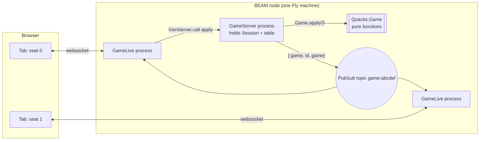

# How Quacks is built

A guide to this codebase for a web developer who learns Elixir and Phoenix.
Written 2026-10-04 against `master` at `ba36f22`; updated the same day to `23aced7`
(icons, motion, EV bots), then to `36d7bbd` plus the `tidy` branch (host handover,
presence and rejoin, acknowledgements, `:not_found`, socket GC), then to `927b0d9`
(bug reports and debug replay, bot plans, the Mandrake answer, name cards with
update chips, the side panel and tablet tabs, the scoring sequence on the pot, the
PWA; 601 tests, 15 doctests, 5 properties).

You know React, TypeScript and browser APIs. This guide maps those ideas onto
Elixir and Phoenix LiveView, and shows each idea in real code from this repo. Every
`path:line` reference points at `master`. When the code moves, the line numbers
drift, but the function names stay searchable.

## The idea in one paragraph

The game rules are one pure function: `Quacks.Game.apply(game, seat, action)` takes a
struct and returns a new struct, or an error. Nothing else in the app knows the rules.
One process per game (`Quacks.GameServer`) holds that struct, applies the moves one at
a time and broadcasts the new struct. Every browser tab is a LiveView process that
listens, re-renders from the struct and sends clicks back. The buttons come from
`Quacks.Game.legal_actions/2`, so the page never has to guess what is allowed.

## Chapters

| # | Chapter | You learn |
|---|---|---|
| 1 | [Map of the repo and the OTP app](guide/01-repo-and-otp.md) | folders, the supervision tree, how `mix phx.server` boots, dev / test / prod |
| 2 | [The pure engine as a state machine](guide/02-engine.md) | structs, `apply/3`, `legal_actions/2`, phases, a draw step by step, expansions as a `MapSet`, `move_droplet/3`, RNG in the struct |
| 3 | [Sessions, log and replay](guide/03-session-log-replay.md) | seed + actions = the game, undo, bundles (`Session.bundle/1`, `from_bundle/2`), the log as UI data |
| 4 | [GameServer and client syncing](guide/04-gameserver.md) | one GenServer per game, PubSub, seats, host and founder, presence (`absent`, `rejoin/3`), `seen`, bot ticks and lockstep, bot plans in concurrent phases, the Mandrake answer with undo, a bot's own rng, bot names, socket GC, `Quacks.BugReports` (Req, ETS rate limit), debug tables |
| 5 | [Routes and the LiveView lifecycle](guide/05-liveview.md) | router, `mount`, events, broadcasts, encoded actions, derived assigns, `"seen"` acknowledgements, `:not_found`, the report form, `/debug/replay`, `mix quacks.replay`, the scrubber |
| 6 | [Components](guide/06-components.md) | function components, HEEx, native dialogs, the side panel and CSS-only tabs, the books column, the SVG pot, compile-time icons, Tailwind tricks, motion (ids, `--beat` on cards, pot and books, the `PotMotion` hook and ruby flights, a view transition, reduced motion), the PWA with no service worker |
| 7 | [Rules as data](guide/07-rules-as-data.md) | `Quacks.Rules.*`, module attributes, why data is not logic, one board order (`Chips.order/0`), patients and test tubes |
| 8 | [Tests](guide/08-tests.md) | ExUnit, helpers, StreamData properties, LiveViewTest, `mix precommit`, the simulator |
| 9 | [The agentic workflow and a cheat sheet](guide/09-workflow.md) | handoffs, worktrees, verification; "where to look when..." |
| 10 | [Elixir idioms you met](guide/10-idioms.md) | pattern matching, `with`, pipes, guards, specs, Credo |
| 11 | [The bots](guide/11-bots.md) | the `Decider` behaviour, profiles as data, exact odds, expected value with memoisation, the choice scorer, the bot at a table (flags, lockstep, plans, names), the simulator |

Read 1, 2 and 4 first. They hold the architecture. The rest you can read in any order.

## React to Elixir, the short table

| React / TS idea | In this repo |
|---|---|
| Redux reducer `(state, action) => state` | `Quacks.Game.apply/3` (`lib/quacks/game.ex:607`) |
| Discriminated union type | tagged tuples, e.g. `{:buy, [chip]}`, and `@type action` (`lib/quacks/game.ex:131`) |
| `switch (action.type)` | several function clauses with pattern matching (`defp step(...)`, `lib/quacks/game.ex:624`) |
| Server state store (a backend) | `Quacks.GameServer`, a GenServer (`lib/quacks/game_server.ex:72`) |
| WebSocket subscription | `Phoenix.PubSub.subscribe/2` in `mount/3` (`lib/quacks_web/live/game_live.ex:119`) |
| Component props | `attr :name, :type` on a function component (`lib/quacks_web/components/game_components.ex:153`) |
| `children` | `slot :inner_block` and `render_slot/1` (`lib/quacks_web/components/core_components.ex:108`) |
| `useState` | none in components; state lives in the LiveView's `assigns` |
| Derived state / selectors | `put_game/2` computes `@me`, `@decision`, `@actions` once per update (`lib/quacks_web/live/game_live.ex:2513`) |
| TS `interface` for a module | a behaviour: `@callback` in `Quacks.AI.Decider` (`lib/quacks/ai/decider.ex:11`) |
| `key` on a list item | the element `id`, e.g. `pot_chip_id/4` (`lib/quacks_web/components/game_components.ex:927`) |
| Framer Motion `layout` / FLIP | the `PotMotion` hook with the Web Animations API (`assets/js/app.js:80`) |
| `staggerChildren` / delayed sequence | `--beat` from `QuacksWeb.Replay`, one CSS delay formula (`assets/css/app.css:981-994`) |
| Optimistic UI (show first, sync later) | the reverse: the first patch is final, CSS delays only *show* it on the beats (chapter 6) |
| An "Undo" toast after an auto action | the server's Mandrake answer kept in `auto_keep`, taken back by `keep_white/2` (`lib/quacks/game_server.ex:499`) |
| `useMediaQuery` to pick sheet or panel | one `<dialog data-side="panel">`; app.js picks `show()` or `showModal()` (`assets/js/app.js:239`) |
| Tabs component with `selectedIndex` state | radio inputs and CSS `:has()` (`assets/css/app.css:618-672`) |
| Redux DevTools export / import with a slider | `Session.bundle/1`, `from_bundle/2` with `at`, the debug scrubber (`lib/quacks/session.ex:99`) |
| `msw` for HTTP in tests | `Req.Test` as the `plug:` option of Req (`config/test.exs:29`) |
| SVGR (`import Icon from "./x.svg"`) | `QuacksWeb.Icons`, SVG read at compile time (`lib/quacks_web/components/icons.ex:55`) |
| Jest + Testing Library | ExUnit + `Phoenix.LiveViewTest` (`test/quacks_web/live/game_live_test.exs`) |
| fast-check | StreamData `property` / `check all` (`test/quacks/game_test.exs:660`) |

## Other docs

- `docs/CONTEXT.md`: the glossary. Every game term, every log entry, every phase.
- `docs/research/`: rules research and tech research. `state-machine-liveview.md`
  explains why the engine is a pure reducer. `components-and-mobile.md` explains the
  dialogs and sheets. `agentic-elixir.md` explains the tooling (usage_rules, Tidewave,
  Credo, StreamData).
- `docs/research/animations.md` (the motion plan), `ai-opponents.md` and `jev-plan.md`
  (the bots).
- `AGENTS.md`: the rules for agents and humans that change this code.
