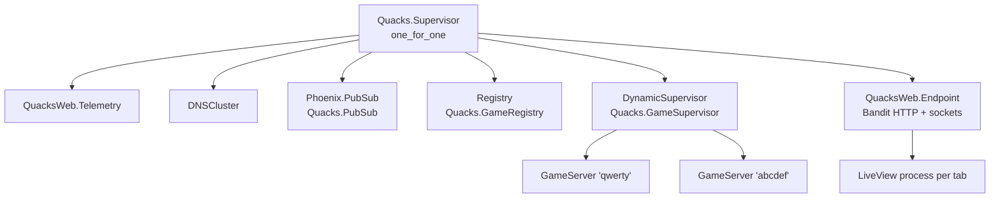

# 1. Map of the repo and the OTP app

[Back to the guide](../GUIDE.md)

## The folders

```
lib/
  quacks/                 the game: no web code
    game.ex               the engine entry point (the reducer)
    game/                 engine parts: potions, evaluation, fortune, witches, essence
    player.ex             one seat's state
    session.ex            seed + action list + game (undo, replay)
    game_server.ex        one process per game
    rules/                data only: pot track, chips, books, cards, witches, patients
    ai.ex, ai/            bots and the headless simulator
    application.ex        the supervision tree
  quacks_web/             the web layer
    router.ex, endpoint.ex
    plugs/player_token.ex browser identity
    live/                 LobbyLive (/) and GameLive (/g/:id)
    components/           function components (core, game, setup, alchemists, icons, layouts)
    replay.ex             beat numbers for the round-results replay
  mix/tasks/quacks.sim.ex `mix quacks.sim`
test/
  quacks/                 engine and GameServer tests
  quacks_web/live/        LiveView tests
  support/game_helpers.ex helpers to hand-build game states
assets/js/app.js          about 160 lines of our own JS (dialogs, PotMotion)
assets/css/app.css        Tailwind v4 theme, the sheet CSS and the motion
config/                   config.exs, dev.exs, test.exs, runtime.exs
docs/                     CONTEXT.md glossary, research/, this guide
```

The split between `lib/quacks` and `lib/quacks_web` is the most important line in
the repo. `lib/quacks` does not know that a browser exists. `lib/quacks_web` does
not know a single game rule. Phoenix generated this split; the project keeps it
strict.

## What "OTP app" means

An Elixir project is an *application*: a bundle of modules plus a start function.
`mix.exs` names that start module:

```elixir
mod: {Quacks.Application, []},
```

(`mix.exs:24`)

When the app starts, the BEAM (the Erlang VM) calls `Quacks.Application.start/2`.
That function starts a *supervisor* with a list of children
(`lib/quacks/application.ex:10-19`):

```elixir
children = [
  QuacksWeb.Telemetry,
  {DNSCluster, query: Application.get_env(:quacks, :dns_cluster_query) || :ignore},
  {Phoenix.PubSub, name: Quacks.PubSub},
  # One `Quacks.GameServer` per game, found by its id (see that module).
  {Registry, keys: :unique, name: Quacks.GameRegistry},
  {DynamicSupervisor, name: Quacks.GameSupervisor, strategy: :one_for_one},
  # Start to serve requests, typically the last entry
  QuacksWeb.Endpoint
]
```

Think of each child as a long-lived "service" inside one OS process. Each child is
an Erlang *process*: a very small green thread with its own memory and a mailbox.
Processes do not share memory. They send messages.

A supervisor watches its children. If a child crashes, the supervisor starts it
again (`strategy: :one_for_one` means "restart only the child that crashed"). This
is why Elixir code often lets errors crash a process instead of catching them.

## The supervision tree



The children, one by one:

- **Telemetry**: metrics for LiveDashboard (`/dev/dashboard` in dev).
- **DNSCluster**: joins other nodes by DNS. Prod sets no query, so it does nothing.
- **Phoenix.PubSub** named `Quacks.PubSub`: a publish/subscribe bus between
  processes. The GameServer publishes, the LiveViews subscribe.
- **Registry** named `Quacks.GameRegistry`: a name table. It maps a game id
  (`"qwerty"`) to the pid of its GameServer. `keys: :unique` means one process per id.
- **DynamicSupervisor** named `Quacks.GameSupervisor`: a supervisor that starts with
  no children. The app adds one GameServer each time a player opens a new game.
- **QuacksWeb.Endpoint**: the HTTP server (Bandit), the static files, the
  `/live` websocket, the router.

Note the order. The Endpoint is last, so no request can arrive before PubSub and
the Registry exist.

A GameServer uses `restart: :temporary` (`lib/quacks/game_server.ex:40`). If one game
crashes, the DynamicSupervisor does *not* restart it: its state is gone anyway, and
the other games keep running. This is the "let it crash" idea at the scale of one
game.

## How `mix phx.server` boots

1. Mix compiles the project (`compilers: [:phoenix_live_view] ++ Mix.compilers()`
   in `mix.exs` also compiles colocated JS hooks).
2. Mix reads `config/config.exs`, which imports `config/dev.exs` at the end
   (`config/config.exs:61`), then `config/runtime.exs`.
3. Mix starts the `:quacks` application, so `Quacks.Application.start/2` runs.
4. The Endpoint starts Bandit on `127.0.0.1` (`config/dev.exs:12`) and the port from
   `PORT`, default 4000 (`config/runtime.exs:23-24`).
5. In dev the Endpoint also starts the watchers: esbuild and Tailwind in watch mode
   (`config/dev.exs:17-20`). You do not run a separate `npm run dev`.
6. In dev the Endpoint plugs in Tidewave (`lib/quacks_web/endpoint.ex:32-34`), the
   MCP server that lets an agent run code inside the live app.

There is no database: no Ecto, no Repo, no migrations. Every game lives in memory.

## Dev, test and prod

| | dev | test | prod (Fly) |
|---|---|---|---|
| Config file | `config/dev.exs` | `config/test.exs` | `config/runtime.exs` (`config_env() == :prod`) |
| HTTP server | yes, port 4000 | no (`server: false`, `config/test.exs:8`) | yes, port 8080 from `PORT` |
| Code reload | yes | no | no |
| Bot delay | 700 ms default | 0 ms (`config/test.exs:25`) | 700 ms |
| Secrets | in the file | in the file | `SECRET_KEY_BASE` and `PHX_HOST` env vars, or the boot fails |

`config/runtime.exs` runs at boot, also inside a release. Compile-time config
(`config.exs`, `dev.exs`) is frozen into the build. Put secrets and per-machine
values only in `runtime.exs`. This file refuses to boot prod without
`PHX_HOST` (`config/runtime.exs:56-58`), because LiveView rejects websocket
connections from an unknown origin, and a silent fallback would break every page.

### Prod on Fly.io

- `fly.toml` runs one machine, always on: `auto_stop_machines = "off"` and
  `min_machines_running = 1` (`fly.toml:16-18`). The comment on line 1 says why:
  games live in memory, so a stopped machine loses every game.
- `.github/workflows/fly-deploy.yml` deploys every push to `master`.
- `.github/workflows/ci.yml` runs `mix precommit` on every push and pull request.
- A deploy restarts the node and ends the running games. This is a known cost of
  "no database".

## What to try

- `iex -S mix phx.server` starts the app *and* a shell into it. Then try
  `Quacks.GameServer.open_games()` or `:observer.start()` to see the process tree.
- `Registry.select(Quacks.GameRegistry, [{{:"$1", :_, :_}, [], [:"$1"]}])` lists the
  running game ids (the same call is in `lib/quacks/game_server.ex:226-237`).
