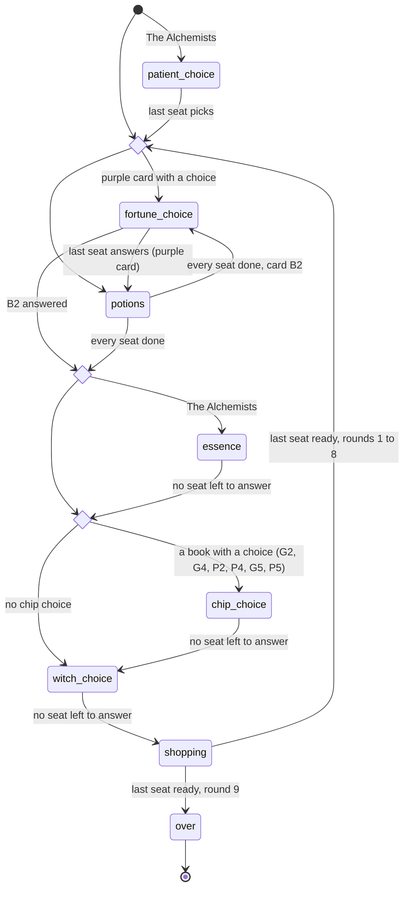
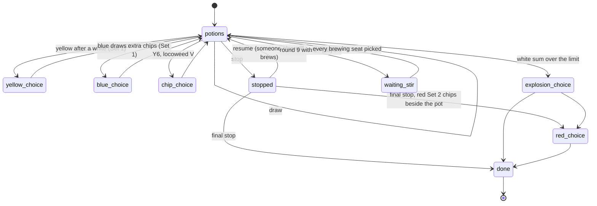

# 2. The pure engine as a state machine

[Back to the guide](../GUIDE.md)

The engine is `Quacks.Game` plus the modules in `lib/quacks/game/`. It has no
processes, no database and no web code. It is a set of functions on one struct.
This is the part of the codebase that makes the rest easy.

## Two structs

A *struct* is a map with a fixed set of keys and a name. It is the Elixir version of
a TypeScript interface with default values. `defstruct` in
`lib/quacks/game.ex:105-119` gives the game 15 fields: `round`, `phase`, `supply`,
`rng`, `log`, `players`, `seats`, the fortune deck and card, `sets`, `rules` and the
expansion fields.

- `players` is a map `%{seat => %Quacks.Player{}}`. Seats are integers `0..7`.
- `phase` is the *game* phase (see the state diagram below).
- `rng` is the random state. Yes, it is in the struct. See "Randomness" below.
- `log` is a list of everything that happened, newest first (chapter 3).

The player struct holds one seat (`lib/quacks/player.ex:45-75`): `bag`, `drawn` (the
pot), `droplet`, `flask`, `rubies`, `coins`, `vp`, its own `phase`, and fields for
the expansions. `drawn` is a list of `{chip, index}` pairs, newest first. A chip is a
plain tuple like `{:white, 2}`.

Everything is immutable. `%{p | rubies: p.rubies + 1}` builds a *new* map with one
key changed; the old `p` is still the same. This is the spread operator
`{...p, rubies: p.rubies + 1}` from JS, but it is the only way to "change" data.

## The two functions that matter

```elixir
def apply(%__MODULE__{} = game, seat, action) do
  action = normalise(action)

  if action in legal_actions(game, seat) do
    # The action goes in the log first, so the events it causes come after it.
    {:ok, game |> record(seat, action) |> step(seat, action)}
  else
    {:error, {:illegal_action, action, phase(game, seat)}}
  end
end
```

(`lib/quacks/game.ex:600-609`)

Read this slowly. It is the whole contract of the engine:

1. An action is legal only if it is in `legal_actions(game, seat)`. There is no
   second set of checks. `apply/3` cannot accept a move that the UI would not offer.
2. A legal action is logged, then `step/3` runs it. `step/3` is private (`defp`)
   and trusts its input, because `apply/3` already checked it.
3. The result is `{:ok, game}` or `{:error, reason}`. The function never raises for a
   bad move. The caller pattern-matches on the tuple.

`legal_actions/2` is the single source of truth for "what can this seat do now":

```elixir
iex> game = Quacks.Game.new(seed: {1, 2, 3}, players: 2)
iex> Quacks.Game.legal_actions(game, 1)
[:draw]
iex> {:ok, game} = Quacks.Game.apply(game, 1, :draw)
iex> Quacks.Game.legal_actions(game, 1)
[:draw, :stop, :use_flask]
```

(This is a doctest in the moduledoc, `lib/quacks/game.ex:57-62`. ExUnit runs it as a
test: `doctest Game` in `test/quacks/game_test.exs:10`.)

Four consumers read the same list:

- the **page** draws one button per action (chapter 5, 6);
- the **bot** picks one action out of it (`lib/quacks/ai.ex:40-53`);
- the **property test** picks random actions out of it (chapter 8);
- `apply/3` itself checks against it.

So a new rule only needs a new action in `legal_actions` and a new `step` clause.
The page shows it, the bot can play it, the property test exercises it.

## Actions are data

An action is an atom (`:draw`, `:stop`) or a tagged tuple (`{:buy, [chip]}`,
`{:rubies, :droplet}`); `@type action` lists them all (`lib/quacks/game.ex:131-153`).
This is a TypeScript discriminated union, without the `type:` field: the first
element of the tuple is the tag. `normalise/1` (`lib/quacks/game.ex:611-613`) makes
equal moves equal, for example it sorts the chips of a `{:buy, chips}`, so
`[a, b]` and `[b, a]` match the same legal action.

## Game phases and player sub-phases

There are two levels of state:

- `game.phase`: where the table is (`:potions`, `:shopping`, ...).
- `player.phase`: where one seat is inside that table phase (`:stopped`,
  `:blue_choice`, `:shop`, `:ready`, ...).

`Game.phase/2` merges them for one seat (`lib/quacks/game.ex:455-465`): in
`:potions`, `:essence` and `:shopping` a seat sees its own sub-phase; in the other
phases it sees the game phase.

### Game phases



`round_start`, `after_potions` and `evaluation` are not values of `game.phase`. They
are functions that run *inside* one `apply/3` call:

- `start_round/1` (`lib/quacks/game.ex:770-777`) draws the fortune card, places the
  rats, then resolves a purple card.
- `Fortune.after_potions/1` (`lib/quacks/game/fortune.ex:83-84`) and
  `Essence.run/1` (`lib/quacks/game/essence.ex:226-228`) pick the next step.
- `Evaluation.run/1` (`lib/quacks/game/evaluation.ex:46-59`) rolls the die, runs the
  chip actions and opens the choices.

`witch_choice` with nobody to ask closes at once (`Witches.open_gold/1`,
`lib/quacks/game/witches.ex:128-137`), so the base game goes from the evaluation
straight to `:shopping` in the same call.

The invariant, from the moduledoc: "The struct never rests without a legal action
for some seat unless `over?/1`" (`lib/quacks/game.ex:19-20`). The property test
checks it after every random move.

### Player sub-phases in `:potions`



`Potions.legal_actions/1` reads only the player (`lib/quacks/game/potions.ex:58-87`):
one clause per sub-phase, for example
`def legal_actions(%Player{phase: :yellow_choice}), do: [:return_white, :keep]`.
Elixir tries the clauses top to bottom and runs the first one whose pattern fits.

## Concurrency without processes

In the real game, everyone draws at the same time. The engine models that without
threads: every seat acts on the same struct, in any order. `step/3` for `:potions`
(`lib/quacks/game.ex:624-637`):

```elixir
defp step(%{phase: :potions} = g, seat, action) do
  g =
    case action do
      {:fortune, _} -> Fortune.step(g, seat, action)
      {:witch, _} -> Witches.step(g, seat, action)
      {:witch, _, _} -> Witches.step(g, seat, action)
      {:essence, _} -> Essence.step(g, seat, action)
      choice when choice in [:draw, :stop] -> stir_or_step(g, seat, choice)
      _ -> Potions.step(g, seat, action)
    end

  g = g |> Essence.open_offers() |> stir() |> Essence.open_offers() |> settle_stops()
  if Enum.all?(g.players, fn {_seat, p} -> p.done? end), do: Fortune.after_potions(g), else: g
end
```

After each action, the pipeline asks "did this action finish something for the
table?":

- `stir/1` (`lib/quacks/game.ex:709-726`): in round 9, once every brewing seat has
  picked `:draw` or `:stop`, the picks resolve together in seat order.
- `settle_stops/1` (`lib/quacks/game.ex:731-742`): once nobody brews any more, a
  soft stop becomes final.
- The last line: once every player is `done?`, the round moves on.

The same pattern appears in every "everyone answers at the same time" phase: each
answer runs, then a `close_choices` function checks whether anybody is still open
(`lib/quacks/game/evaluation.ex:78-85`, `lib/quacks/game/fortune.ex:309-316`).

Who orders two clicks that arrive at the same moment? Not the engine. The
GameServer handles one message at a time (chapter 4). The engine only needs to be
correct for any order.

## A draw, step by step

Follow `apply(game, 0, :draw)` in a base game.

1. `apply/3` checks `:draw in legal_actions(game, 0)`, logs `{0, :draw}`, calls
   `step/3`.
2. `step/3` for `:potions` sends `:draw` to `Potions.step/3`.
3. `Potions.step(g, seat, :draw)` (`lib/quacks/game/potions.ex:93-111`) takes one
   random chip out of the bag with `take_random/3`, then calls `resolve_draw/3`.

4. `resolve_draw/3` (`lib/quacks/game/potions.ex:295-322`) finds the chip's *book*
   (`acting/3`: `{colour, set}`, for example `{:red, 1}`), places the chip, then
   checks the white sum with one `cond`: no explosion, a safe draw (card B3),
   a protected draw (crow skull B2), or `explode/2`.

5. `place/5` computes the move: the chip's value, plus `bonus/3`, plus a card bonus
   (`lib/quacks/game/potions.ex:525-544`). `put_on_pot/4` puts `{chip, index}` on the
   front of `drawn` and logs `{seat, {:drew, chip, index}}`
   (`lib/quacks/game/potions.ex:548-560`).
6. `on_draw/4` runs the chip's on-draw action. It dispatches on the book with one
   function clause per book (`lib/quacks/game/potions.ex:385-517`):

   ```elixir
   defp on_draw(g, seat, {:yellow, _}, {:yellow, 1}) do
     case Game.player(g, seat).drawn do
       [_, {{:white, _}, _} | _] -> Game.update_player(g, seat, &%{&1 | phase: :yellow_choice})
       _ -> g
     end
   end
   ```

   The pattern `[_, {{:white, _}, _} | _]` reads: "a list whose *second* element is a
   white chip on any space". If it matches, the player gets a choice. No `if`, no
   index arithmetic.

7. The last clause, `defp on_draw(g, _seat, _chip, _book), do: g`
   (`lib/quacks/game/potions.ex:517`), is the default: a book with no on-draw
   action does nothing.

The explosion limit (`explode_above/2`, `lib/quacks/game/potions.ex:357-363`) is the
highest of three values: the house rule, the yellow Set 3 modifier in the player's
`mods` and the B5 card. `mods` holds the round modifiers of the chips
(`lib/quacks/player.ex:75`) and resets at the end of the round
(`lib/quacks/player.ex:225`).

## Evaluation (step B and the rest)

When the last seat is done, `Evaluation.run/1` runs for all seats in turn order
(`lib/quacks/game/evaluation.ex:46-59`):

- Step A, `bonus_die/2`: the highest scoring space rolls (`:rand.uniform_s` on the
  game's `rng`, `lib/quacks/game/evaluation.ex:121-136`).
- Step B, `chip_actions/3`: black, green, purple, each by its book. Note the third
  argument `g0`, the game before step A: the black book compares pots *before* step
  B changed them, and the standings *before* the die paid VP. Passing the old
  struct is free, because data is immutable.
- Whom black book I compares with is one function, `Evaluation.targets/2`. It
  dispatches on the house rule `black_rule`: `:neighbours` (the rulebook) or
  `:standings` (round 16, unofficial: the players ranked directly above, from
  `Evaluation.standings/1`; the leader takes ranks 2 and 3, the last player only the
  one above). The payoff (`black_payoff/2`) only sees a list of one or two counts,
  so it did not change. The reveal's black slide calls the same `targets/2`.
- Books with a choice (G2, G4, P2, P4, G5, P5) put choices on the player. If any
  seat has one, the game waits in `:chip_choice`. If not, `close_choices/1` goes on
  at once.
- Steps C and D, `payout/2` (`lib/quacks/game/evaluation.ex:527-552`): rubies, VP,
  coins from the scoring space. Then `Game.to_shop/1` opens `:shopping`.

## Fortune cards, witches, the Alchemists

The expansions plug in at the same seams:

- **Fortune cards** (`lib/quacks/game/fortune.ex`). A card is drawn at
  `start_round/1`. A purple card resolves at once and may open `:fortune_choice`. A
  blue card stays on `game.fortune_card` for the round, and the rules read it through
  small hooks: `explode_above/1`, `extra_move/2`, `die_rolls/1`, `on_stop/2`,
  `ruby_space/2`, `refill_flasks/1` (`lib/quacks/game/fortune.ex:161-228`). Each hook
  is a function clause that matches one card plus a default clause (chapter 10).

- **Witches** (`lib/quacks/game/witches.ex`). `Witches.legal_actions/2` adds
  `{:witch, colour}` actions when that colour may be called now. In the base game
  `witches` is `nil` and the first clause returns `[]`
  (`lib/quacks/game/witches.ex:43`).
- **The Alchemists** (`lib/quacks/game/essence.ex`). Two new game phases. At
  `Game.new/1`, `Essence.setup/1` deals 3 patients and sets `phase: :patient_choice`
  (`lib/quacks/game/essence.ex:43-46`); each seat answers `{:patient, id}`, and the
  last answer starts round 1. After the potions, `Essence.run/1` is the switch
  (`lib/quacks/game/essence.ex:226-228`): with the expansion it opens `:essence`, in
  which each seat's essence marker moves and may wait for a choice
  (`:essence_choice`, `:essence_bonus`); else it calls `Evaluation.run/1` directly.
  The patients' data is in `Quacks.Rules.Alchemists` (chapter 7).

Each expansion module has the same shape: `legal_actions(g, seat)` and
`step(g, seat, action)`. `Game.phase_actions/2` concatenates their lists with `++`
(`lib/quacks/game.ex:528-531`).

### Expansions are a set

A game can have both expansions, so `expansions` is a `MapSet`
(`lib/quacks/game.ex:117`), the Elixir `Set`. `Game.new/1` accepts a list and
checks it (`expansions!/1`, `lib/quacks/game.ex:395-403`). The rest of the code asks
one question (`lib/quacks/game.ex:405-407`):

```elixir
@doc "Is expansion `x` (`:herb_witches`, `:alchemists`) in play?"
@spec expansion?(t, expansion) :: boolean
def expansion?(%__MODULE__{expansions: expansions}, x), do: MapSet.member?(expansions, x)
```

The old field `expansion` (`:herb_witches` or `nil`) stays for code that only knows
The Herb Witches (`lib/quacks/game.ex:44-46`). New code calls `expansion?/2`, for
example `Essence.run/1` and the "Expansions:" line on the page
(`lib/quacks_web/live/game_live.ex:924-929`). It is a small API in front of the data:
the callers do not care if the field is a set, a list or two booleans.

### One door for droplet moves

Many rules move the droplet: the bonus die, black chips, fortune cards, an essence
glass. All of them call `Game.move_droplet/3` (`lib/quacks/game.ex:863-870`):

```elixir
def move_droplet(%__MODULE__{} = g, _seat, 0), do: g

def move_droplet(%__MODULE__{} = g, seat, n) do
  if g.rules.pot_side == :back and player(g, seat).tube < TestTubes.last(),
    do: update_player(g, seat, &%{&1 | droplet_moves: &1.droplet_moves + n}),
    else: update_player(g, seat, &pot_droplet(&1, n))
end
```

On the normal pot side the droplet moves at once. On the reverse pot side (house
rule `pot_side: :back`) each move waits for the player's choice: the pot droplet or
one glass on the test-tube track (`Quacks.Rules.TestTubes`, chapter 7). The moves
wait in `droplet_moves`, and `Game.phase/2` shows `:droplet_choice` while any wait,
in any game phase (`lib/quacks/game.ex:455-465`). Because every caller uses this
one function, the house rule needed no change in the callers.

## Randomness lives in the struct

`Game.new/1` seeds a random state and stores it: `rng = :rand.seed_s(:exsss, seed)`
(`lib/quacks/game.ex:365`). Every random pick reads `g.rng` and writes the new state back
(`lib/quacks/game/potions.ex:633-642`):

```elixir
def take_random(g, seat, n) do
  size = length(Game.player(g, seat).bag)

  Enum.reduce(1..min(n, size)//1, {[], g}, fn _, {taken, g} ->
    bag = Game.player(g, seat).bag
    {i, rng} = :rand.uniform_s(length(bag), g.rng)
    {chip, bag} = List.pop_at(bag, i - 1)
    {[chip | taken], %{Game.update_player(g, seat, &%{&1 | bag: bag}) | rng: rng}}
  end)
end
```

The `_s` functions of `:rand` take a state and return `{value, new_state}`. They are
pure. `Enum.random/1`, `Enum.shuffle/1` and `:rand.uniform/1` instead use a hidden
state in the *process dictionary* (a per-process global). `AGENTS.md` bans them in
the engine. Why it matters:

- **Replay**: the seed plus the action list rebuilds the exact game
  (`Quacks.Session.replay/4`, chapter 3). With a hidden state, the second run draws
  other chips.
- **Undo**: undo *is* replay minus one action. It only works if replay is exact.
- **Tests**: `test "a fixed seed draws the same chips every time"`
  (`test/quacks/game_test.exs:40-46`). A bug report is a seed and a list of moves.
- **Bots**: a bot reads the game but has its own rng (`Quacks.AI.new_rng/2`,
  `lib/quacks/ai.ex:32`), so adding a bot never changes the chips a human draws.

One more trick: the fortune deck and the witches shuffle with a *jump* of the game
rng (`:rand.jump/1`, `lib/quacks/game/fortune.ex:48` and
`lib/quacks/rules/witches.ex:115`). A jump is a separate stream from the same seed.
So a game with cards draws the same chips as the same seed without cards.

(`GameServer` does call `:rand.uniform/1`, at `lib/quacks/game_server.ex:1053-1054`, to make
a new random *seed*. That is outside the engine and is fine.)

## Small helpers you see everywhere

`Game.player/2`, `Game.update_player/3` and `Game.record/2,3`
(`lib/quacks/game.ex:907-917`) read a seat, change a seat and append to the log. Most
engine code is a pipeline of them: `g |> update_player(seat, fn p -> ... end) |>
record(seat, event)`. Chapter 10 explains the short `&%{&1 | ...}` syntax.
