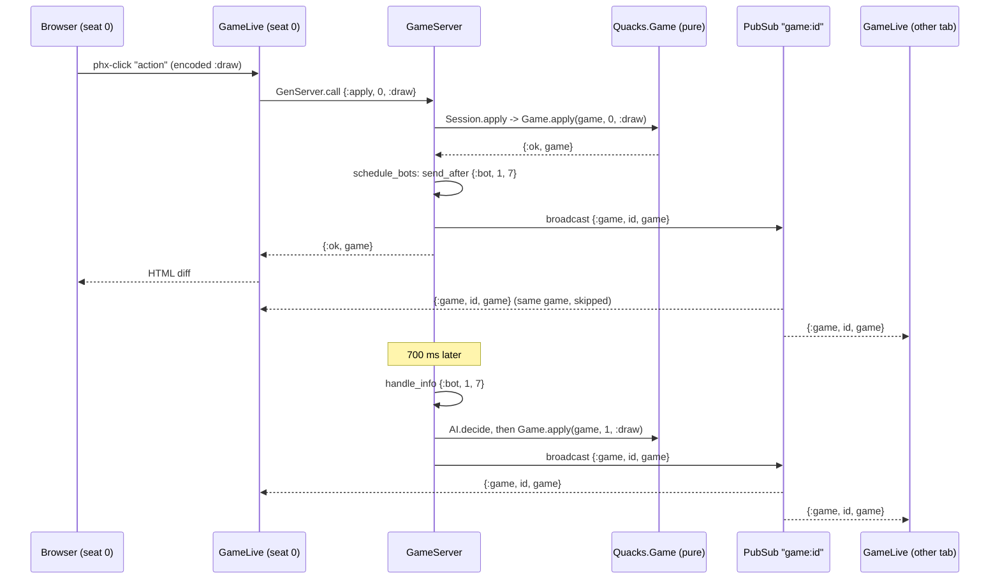

# 4. GameServer and client syncing

[Back to the guide](../GUIDE.md)

The engine is pure, so it needs a home. `Quacks.GameServer`
(`lib/quacks/game_server.ex`) is that home: one process per game.

## Why a process per game

The moduledoc answers this (`lib/quacks/game_server.ex:6-13`):

> A LiveView process lives as long as one browser tab. When two or more browsers
> play the same game, the game must live somewhere they can all reach, and every
> change must reach every tab. A GenServer gives us exactly that: it serialises the
> moves (two clicks at the same moment are applied one after the other, never on top
> of each other), it is found by its short game id through `Quacks.GameRegistry`,
> and after every change it broadcasts on `Quacks.PubSub` (topic `"game:" <> id`),
> so each LiveView re-renders. The rules stay in the pure `Quacks.Game`; this module
> only stores, serialises and announces.

In React terms: the GameServer is a tiny backend with its own store, and PubSub is
the websocket push to every client. But it is one module in the same node, with no
network hop between them.

## What a GenServer is

A GenServer is a process that loops: wait for a message, handle it, keep the new
state, wait again. You write the handlers; OTP writes the loop. The mailbox handles
one message at a time, so two moves can never race. This is why the engine needs no
locks.

The module has two halves. The **client API** (`apply/3`, `get/1`, ...) runs in the
caller's process and sends a message. The **callbacks** (`init/1`,
`handle_call/3`, `handle_info/2`) run in the GameServer process:

```elixir
def handle_call({:apply, seat, action}, _from, state) do
  case Session.apply(state.session, seat, action) do
    {:ok, session} -> reply_game(schedule_bots(%{state | session: session}))
    error -> {:reply, error, state, @idle_timeout}
  end
end
```

(`lib/quacks/game_server.ex:302-307`)

The GameServer adds no rule. It calls `Session.apply/3`, keeps the new session,
schedules the bots and broadcasts.

## Finding a game by id

`start_link/1` registers the process under its 6-letter id with
`name: {:via, Registry, {Quacks.GameRegistry, id}}` (`lib/quacks/game_server.ex:132-133`).
`call/2` looks the id up and turns a missing or just-stopped game into
`{:error, :not_found}` (`lib/quacks/game_server.ex:257-264`). If two new games draw
the same id, the start fails with `:already_started` and the code tries again
(`lib/quacks/game_server.ex:117-129`).

## `call` versus `cast`

`GenServer.call/2` sends and waits for the reply (5 s by default).
`GenServer.cast/2` sends and does not wait. This module uses only `call`: every
client needs an answer (the new game, or an error to show as a flash), and a `call`
gives back-pressure, because a page waits for each reply. `AGENTS.md` says the same:
"When in doubt, use `call` over `cast`".

## The state

`init/1` builds a plain map (`lib/quacks/game_server.ex:275-294`): the `session`
(`nil` while `:waiting`), `tokens` (`%{player_token => seat}`), `names`, `colours`,
the `creator` token, the bot fields, and the settings for `Session.new/3`.
`table/1` turns it into the public view that pages read, without the tokens
(`lib/quacks/game_server.ex:656-676`). Tokens never leave the process.

## Idle timeout

Every reply ends with `@idle_timeout`, for example `{:reply, error, state, @idle_timeout}`.
The fourth element is a GenServer timeout: if no message arrives in that time, OTP
sends the process `:timeout` (`lib/quacks/game_server.ex:512-517`):

```elixir
# No message for @idle_timeout: nobody plays this game any more.
@impl true
def handle_info(:timeout, state) do
  broadcast_lobby()
  {:stop, :normal, state}
end
```

`@idle_timeout` is `:timer.hours(2)` (`lib/quacks/game_server.ex:45`). Any message
resets it. No cron job, no cleanup table.

## Broadcasts

The topic per game is `"game:" <> id` (`lib/quacks/game_server.ex:248`). Three
messages:

- `{:game, id, game}`: the new struct after every applied action (`reply_game/1`,
  `lib/quacks/game_server.ex:645-649`);
- `{:names, id, names}`: a seat, name, colour or setting changed;
- `{:play_again, id, new_id}`: everyone moves to the next game.

The lobby listens on its own topic, `"lobby"`, for `:games_changed`.

Every LiveView of the game re-renders from the *same* struct. There is no diff
protocol of our own: the struct goes to each LiveView process in memory, and
LiveView sends only the changed HTML to each browser. The acting page gets the game
twice (reply and broadcast) and skips the copy it already has
(`lib/quacks_web/live/game_live.ex:308-313`).

## Seats and identity

There are no accounts. A plug gives every browser a random token in the signed
session cookie (`lib/quacks_web/plugs/player_token.ex:15-21`):

```elixir
def call(conn, _opts) do
  if get_session(conn, "player_token") do
    conn
  else
    put_session(conn, "player_token", Base.url_encode64(:crypto.strong_rand_bytes(16)))
  end
end
```

`GameLive.mount/3` reads it from `session` and calls `claim_seat/2`
(`lib/quacks_web/live/game_live.ex:105-109`). The same token gets the same seat
back, so a reload keeps your seat (`lib/quacks/game_server.ex:321-322`). Later
clicks send only `seat` and `action`; the seat is a server-side assign, so the
browser cannot pick another seat.

The first token to take a seat is the host: `creator: state.creator || token`
(`lib/quacks/game_server.ex:330`). `configure/3`, `add_bot/3`, `remove_bot/3` and
`begin/2` check it, for example `token != state.creator -> {:reply, {:error,
:not_creator}, ...}` (`lib/quacks/game_server.ex:397-398`).

## Bots: the same path as humans

A bot is a seat with a profile in `bots`. It acts through `Session.apply/3`, the
same function a human click uses, so a bot cannot make a move a human could not.

After every change, `schedule_bots/1` gives each bot seat that can act a *tick*, a
message to itself for later (`lib/quacks/game_server.ex:546-560`):

```elixir
tick = state.tick + 1
Process.send_after(self(), {:bot, seat, tick}, delay)
%{state | tick: tick, bot_ticks: Map.put(state.bot_ticks, seat, tick)}
```

The delay is 700 ms (0 in tests, `config/test.exs:25`), so a human can see the bot
draw. When the tick arrives (`lib/quacks/game_server.ex:521-541`):

```elixir
def handle_info({:bot, seat, tick}, %{bot_ticks: ticks} = state)
    when :erlang.map_get(seat, ticks) == tick do
```

The body is one `with` chain: not capped, `AI.decide/4` picks an action,
`Session.apply/3` applies it, then the broadcast. Any other tick falls through to
`def handle_info({:bot, _seat, _tick}, state), do: {:noreply, state, @idle_timeout}`.

**Versioned ticks.** A tick waits 700 ms in the mailbox. In that time a human can
act and the game can change. Each bot seat has at most one pending tick number in
`bot_ticks`. The guard accepts only that number; the second clause drops any stale
tick. (`:erlang.map_get/2` is allowed in a guard; `Map.get/2` is not.)

**Lockstep.** Bots draw faster than humans. `capped?/3` stops a bot from drawing
more chips this round than the human who drew most
(`lib/quacks/game_server.ex:564-573`). A capped bot gets no tick; the next human
action schedules it again.

Lockstep makes a bot brew at human speed: draw for draw, never ahead of the
fastest human. Round 9 has no cap, because the stir (chapter 2) already makes every
seat pick together.

**Each bot has its own rng.** `AI.decide/4` takes an rng and gives back the next
one: `{action, rng}`. The GameServer keeps one per bot seat in `bot_rngs`. At the
start, `begin_game/1` seeds them from the game seed and the seat
(`lib/quacks/game_server.ex:627`):

```elixir
bot_rngs: Map.new(bots, fn {seat, _} -> {seat, AI.new_rng(state.seed, seat)} end)
```

After each bot move, the tick handler stores the new state:
`bot_rngs: Map.put(state.bot_rngs, seat, rng)` (`lib/quacks/game_server.ex:533`).
This is a `useReducer` that threads its own seed instead of calling
`Math.random()`. The bot never touches `game.rng`, so a bot's choice cannot change
the chips anyone draws. Chapter 11 says more.

**Bot names.** `add_bot/3` gives the bot a name that nobody at the table has
(`seat_bot/2`, `lib/quacks/game_server.ex:590-604`):

```elixir
{name, name_rng} = Names.pick(Map.values(state.names), state.name_rng)
```

`Quacks.AI.Names` (`lib/quacks/ai/names.ex`) is a list of 20 alchemist names and
one pure function. `pick/2` takes a free name with `:rand.uniform_s/2` on the
table's `name_rng`, seeded from the game seed in `init/1`
(`lib/quacks/game_server.ex:286`). When the list runs out, the bot is "Bot N". So
the same seed gives the same names, and a test can name them in advance.

## Sequence: a human draws, the bots follow



## Crashes and deploys

- An exception in a `handle_call` ends that one GameServer (`restart: :temporary`).
  Its pages get `{:error, :not_found}` on the next call. Other games run on.
- A deploy restarts the node and every game is gone
  (`lib/quacks/game_server.ex:36-37`). To survive that, the state to save is small:
  `{seed, players, opts, actions}` plus the table (chapter 3).
