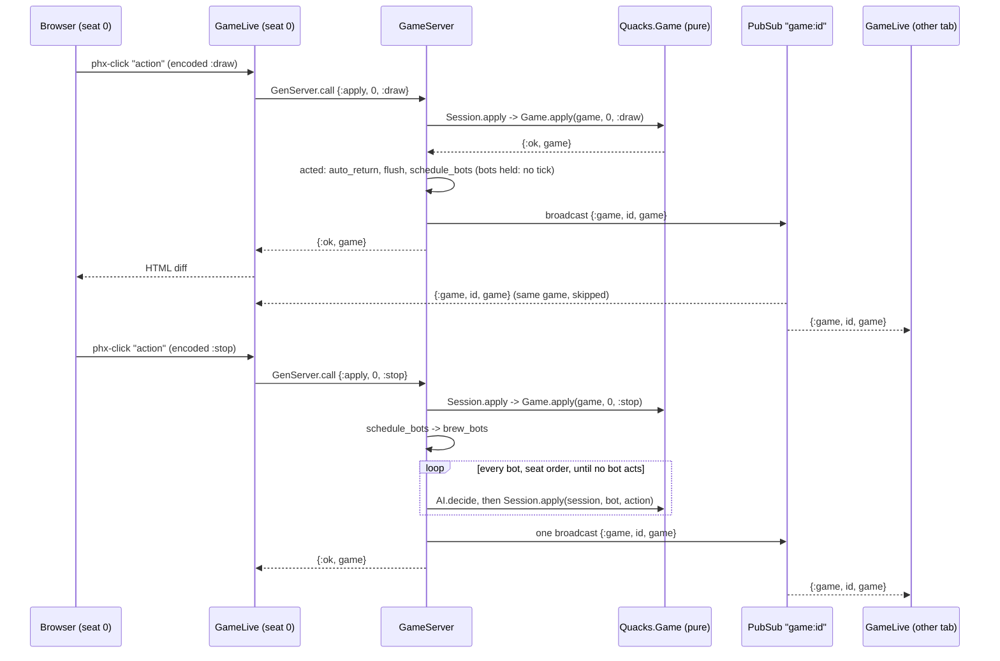

# 4. GameServer and client syncing

[Back to the guide](../GUIDE.md)

The engine is pure, so it needs a home. `Quacks.GameServer`
(`lib/quacks/game_server.ex`) is that home: one process per game.

## Why a process per game

The moduledoc answers this (`lib/quacks/game_server.ex:5-13`):

> A LiveView process lives as long as one browser tab. When two or more browsers
> play the same game, the game must live somewhere they can all reach, and every
> change must reach every tab. A GenServer gives us exactly that: it serialises the
> moves (two clicks at the same moment are applied one after the other, never on top
> of each other), it is found by its short game id through `Quacks.GameRegistry`,
> and after every change it broadcasts on `Quacks.PubSub` (topic `"game:" <> id`),
> so each LiveView re-renders. The rules stay in the pure `Quacks.Game`; this module
> only stores, serialises and announces.

In React terms: the GameServer is a tiny backend with its own store, and PubSub is
the websocket push to every client. But it is one module in the same node, with no
network hop between them.

## What a GenServer is

A GenServer is a process that loops: wait for a message, handle it, keep the new
state, wait again. You write the handlers; OTP writes the loop. The mailbox handles
one message at a time, so two moves can never race. This is why the engine needs no
locks.

The module has two halves. The **client API** (`apply/3`, `get/1`, ...) runs in the
caller's process and sends a message. The **callbacks** (`init/1`,
`handle_call/3`, `handle_info/2`) run in the GameServer process:

```elixir
def handle_call({:apply, seat, action}, _from, state) do
  case Session.apply(state.session, seat, action) do
    {:ok, session} -> reply_game(acted(%{state | session: session}))
    error -> {:reply, error, state, @idle_timeout}
  end
end
```

(`lib/quacks/game_server.ex:489-494`)

The GameServer adds no rule. It calls `Session.apply/3`, keeps the new session,
runs `acted/1` and broadcasts. `acted/1` is one pipe
(`lib/quacks/game_server.ex:808`):

```elixir
defp acted(state), do: state |> auto_return() |> flush() |> schedule_bots()
```

It answers a human's Mandrake question, applies the queued bot plans, then gives
the bots their ticks. Each step is below.

## Finding a game by id

`start_link/1` registers the process under its 6-letter id with
`name: {:via, Registry, {Quacks.GameRegistry, id}}` (`lib/quacks/game_server.ex:231-232`).
`call/2` looks the id up and turns a missing or just-stopped game into
`{:error, :not_found}` (`lib/quacks/game_server.ex:388-396`). If two new games draw
the same id, the start fails with `:already_started` and `start_server/1` tries
again (`lib/quacks/game_server.ex:157-171`).

## `call` versus `cast`

`GenServer.call/2` sends and waits for the reply (5 s by default).
`GenServer.cast/2` sends and does not wait. This module uses only `call`: every
client needs an answer (the new game, or an error to show as a flash), and a `call`
gives back-pressure, because a page waits for each reply. `AGENTS.md` says the same:
"When in doubt, use `call` over `cast`".

## The state

`init/1` builds a plain map (`lib/quacks/game_server.ex:410-439`): the `session`
(`nil` while `:waiting`), `tokens` (`%{player_token => seat}`), `names`, `colours`,
the `creator` token, the bot fields (`bots`, `bot_rngs`, `bot_ticks`, `queued`),
`auto_keep`, `seen`, `pages`, `debug` and the settings for `Session.new/3`.
`table/1` turns it into the public view that pages read, without the tokens
(`lib/quacks/game_server.ex:1023-1047`). Tokens never go to a page; only the game
file on disk has them ("Games on disk" below).

The table fields that are not plain settings (type `table`,
`lib/quacks/game_server.ex:84-116`):

| Field | What it holds | Who reads it |
|-------|---------------|--------------|
| `creator` | the seat of the **host** now: `host/1` (`lib/quacks/game_server.ex:1004-1013`) | the waiting panel (who may start or fill the open seats with bots) |
| `founder` | the seat of the browser that **created** the table (`state.tokens[state.creator]`), `nil` while that browser is not seated | the Games list and restore (which browser opened the table) |
| `absent` | the human seats with no live page now, from `absent/1` (`lib/quacks/game_server.ex:800-804`) | the spectator note: "Rejoin as ..." buttons |
| `seen` | per seat, `%{card: round, results: round}`: the last fortune card and round results (update chips) that seat closed | `GameLive` mounts them closed (see `ack/4` below) |
| `debug` | `nil`, or `%{at, total, frozen}` for a table built from a bug report | the menu's scrubber (chapter 5) |

`creator` and `founder` differ only after a handover: when the creator leaves a
waiting table, the browser with the lowest seat is host (`creator`), but `founder`
is `nil`, so the new host's own saved settings do not load and the table keeps what
the creator set (QA2 N2).

## Idle timeout

Every reply ends with `@idle_timeout`, for example `{:reply, error, state, @idle_timeout}`.
The fourth element is a GenServer timeout: if no message arrives in that time, OTP
sends the process `:timeout` (`lib/quacks/game_server.ex:747-752`):

```elixir
# No message for @idle_timeout: nobody plays this game any more.
@impl true
def handle_info(:timeout, state) do
  broadcast_lobby()
  {:stop, :normal, state}
end
```

`@idle_timeout` is `:timer.hours(2)` (`lib/quacks/game_server.ex:77`). Any message
resets it. No cron job, no cleanup table.

## Broadcasts

The topic per game is `"game:" <> id` (`lib/quacks/game_server.ex:378`). Four
messages:

- `{:game, id, game}`: the new struct after every applied action (`reply_game/1`,
  `lib/quacks/game_server.ex:998-1002`);
- `{:names, id, names}`: a seat, name, colour or setting changed, or a seat came
  or went (presence, below);
- `{:host, id, seat}`: the creator left a waiting table and `seat` is host now (the
  page shows "You are now the host.");
- `{:play_again, id, new_id}`: everyone moves to the next game.

The lobby listens on its own topic, `"lobby"`, for `:games_changed`.

Every LiveView of the game re-renders from the *same* struct. There is no diff
protocol of our own: the struct goes to each LiveView process in memory, and
LiveView sends only the changed HTML to each browser. The acting page gets the game
twice (reply and broadcast) and skips the copy it already has. It also skips a
broadcast with a shorter log than the game it shows: that copy is older and came in
late (`lib/quacks_web/live/game_live.ex:445-455`).

## Seats and identity

There are no accounts. A plug gives every browser a random token in the signed
session cookie (`lib/quacks_web/plugs/player_token.ex:15-21`):

```elixir
def call(conn, _opts) do
  if get_session(conn, "player_token") do
    conn
  else
    put_session(conn, "player_token", Base.url_encode64(:crypto.strong_rand_bytes(16)))
  end
end
```

`GameLive.mount/3` reads it from `session` and calls `claim_seat/3`
(`lib/quacks_web/live/game_live.ex:121-125`). The same token gets the same seat
back, so a reload keeps your seat (`lib/quacks/game_server.ex:521-522`). Later
clicks send only `seat` and `action`; the seat is a server-side assign, so the
browser cannot pick another seat.

The first token to take a seat is the creator: `creator: state.creator || token`
(`lib/quacks/game_server.ex:533`). The host is the creator while seated, else the
seated browser with the lowest seat (`host/1`, `lib/quacks/game_server.ex:1004-1013`).
`configure/3`, `add_bot/3`, `remove_bot/3`, `fill_bots/2` and `begin/2` check it, for example
`token != host(state) -> {:reply, {:error, :not_creator}, ...}`
(`lib/quacks/game_server.ex:608-609`).

## Bots: the same path as humans

A bot is a seat with a profile in `bots`. It acts through `Session.apply/3`, the
same function a human click uses, so a bot cannot make a move a human could not.

After every change, `schedule_bots/1` gives each bot seat that can act a *tick*, a
message to itself for later (`lib/quacks/game_server.ex:887-913`):

```elixir
tick = state.tick + 1
Process.send_after(self(), {:bot, seat, tick}, delay)
%{state | tick: tick, bot_ticks: Map.put(state.bot_ticks, seat, tick)}
```

The delay is 700 ms (0 in tests, `config/test.exs:25`), so a human can see the bot
draw. When the tick arrives (`lib/quacks/game_server.ex:757-779`):

```elixir
def handle_info({:bot, seat, tick}, %{bot_ticks: ticks} = state)
    when :erlang.map_get(seat, ticks) == tick do
  ...
  with false <- held?(state.session.game),
       false <- humans_deciding?(state, state.session.game),
       nil <- state.auto_keep,
       {action, rng} <- AI.decide(state.session.game, seat, profile, state.bot_rngs[seat]),
       {:ok, session} <- Session.apply(state.session, seat, action) do
```

The body is one `with` chain: not held (below), no human still decides in a concurrent
phase, no Mandrake answer open, `AI.decide/4` picks an action, `Session.apply/3`
applies it, then `acted/1` and the broadcast. `with` can match on any value, not
only `{:ok, _}`: `false <-` and `nil <-` are plain checks. Any other tick falls
through to
`def handle_info({:bot, _seat, _tick}, state), do: {:noreply, state, @idle_timeout}`.

**Versioned ticks.** A tick waits 700 ms in the mailbox. In that time a human can
act and the game can change. Each bot seat has at most one pending tick number in
`bot_ticks`. The guard accepts only that number; the second clause drops any stale
tick. (`:erlang.map_get/2` is allowed in a guard; `Map.get/2` is not.)

**Brews in one go (round 36).** In the potions phase of rounds 1–8 a bot gets
no tick at all (`held?/1`, `lib/quacks/game_server.ex:1281-1282`). While a human
seat still draws, the bots wait; their tiles show "brewing" and no chips, because
they have drawn none. When the last human seat stops or explodes, the next
`schedule_bots/1` calls `brew_bots/2` first (`lib/quacks/game_server.ex:1284-1335`):

```elixir
with true <- held?(game),
     false <- Enum.any?(game.seats -- Map.keys(state.bots), &drawing?(game, &1)),
     {seat, action, rng, engine_us, session} <- next_brew(state) do
  log_action(state.id, seat, {:bot, action}, :ok, engine_us, started)
  state = %{state | session: session, bot_rngs: Map.put(state.bot_rngs, seat, rng)}
  brew_bots(state, started, budget - 1)
else
  _no_brew -> state
end
```

`next_brew/1` asks the bots in seat order and takes the first that has an action,
so bot 1 brews to its stop, then bot 2. The last stop settles every soft stop
(chapter 2), and a bot may then act once more (red chips beside the pot). It all
runs inside the human's `:stop` call: `reply_game/1` sends one broadcast with every
bot's pot, and `stored/2` schedules one file write. Each action still goes through
`Session.apply/3`, so the log, replay and a bug report's bundle hold every draw.

Two effects on play. The draws on the shared `game.rng` come in a new order:
the humans first, then the bots. And a stopped human cannot `:resume` after a bot's
draw any more, because the bots stop in the same call. Round 9 keeps its ticks: the
stir already makes every seat draw together. A tick that arrives from an earlier
phase is dropped by `held?/1`; a tick that runs `schedule_bots/1` and so brews
broadcasts too (`broadcast_changed/2`).

## Decisions revealed together: bot plans

Some phases have no turn order: every seat decides at the same time. They are
`@concurrent [:fortune_choice, :chip_choice, :witch_choice, :shopping]`
(`lib/quacks/game_server.ex:827`). With ticks, a bot would buy its chips 700 ms
into the shop, and a human could see the bot's buy before they choose. That is
not fair either way. So in these phases a bot does not tick. It *plans*.

`plan/2` (`lib/quacks/game_server.ex:863-885`) runs the bot's whole part of the
phase at once, on a private copy of the game:

```elixir
Enum.reduce_while(1..30, {game, [], state.bot_rngs[seat]}, fn _, {g, actions, rng} ->
  with true <- g.phase == game.phase,
       {action, rng} <- AI.decide(g, seat, profile, rng),
       {:ok, g} <- Game.apply(g, seat, action) do
    {:cont, {g, [action | actions], rng}}
  else
    _done -> {:halt, {g, actions, rng}}
  end
end)
```

The copy costs nothing to make: the engine is pure, so `g` is just a value that
nobody else sees. The plan (for example a buy, a ruby spend and `:end_round`)
waits in `queued`, `%{seat => [action]}`. `schedule_bots/1` plans instead of ticking
while `humans_deciding?/2` says a human seat still has a legal action in the phase
(lines 829-833).

After each action, `flush/1` (lines 835-861) checks again. When no human decides
any more, it applies every plan, seat by seat, through `Session.apply/3`:

```elixir
defp apply_plan({seat, actions}, state) do
  Enum.reduce_while(actions, state, fn action, state ->
    case Session.apply(state.session, seat, action) do
      {:ok, session} -> {:cont, %{state | session: session}}
      {:error, _} -> {:halt, state}
    end
  end)
end
```

Each action is legal-checked again, because the humans acted after the plan was
made. If a limited supply ran out, the rest of that plan drops, and the bot decides
again with normal ticks. A flushed plan can end the phase and open the next
concurrent one, so `flush_again/1` runs once more.

React has a near idea: commit several state updates in one batch, so no render
shows half of them. Here the batch is "every bot's choice of this phase", and it
waits for the humans.

## Mandrake: a server answer with undo

The Mandrake (yellow 1, Set 1) asks "put the white chip back?" after a white chip.
The answer is nearly always yes, and the question stopped humans on every draw. So
the server answers `:return_white` for each human seat at once (`auto_return/1`,
`lib/quacks/game_server.ex:813-824`) and keeps the session from before that
answer in `auto_keep`:

```elixir
{:ok, session} = Session.apply(state.session, seat, :return_white)
%{state | session: session, auto_keep: {seat, state.session}}
```

The player can still say no. The page shows "Keep the white chip instead" while
the newest log entries are this seat's `:return_white` and `{:returned, chip}`
(`keep_white?/3`, `lib/quacks_web/live/game_live.ex:2688-2693`). The click calls
`keep_white/2` (`lib/quacks/game_server.ex:499-502`), which applies `:keep` on the
old session:

```elixir
def handle_call({:keep_white, seat}, _from, %{auto_keep: {seat, before}} = state) do
  {:ok, session} = Session.apply(before, seat, :keep)
  reply_game(acted(%{state | session: session}))
end
```

The match `%{auto_keep: {seat, before}}` uses `seat` twice, so it matches only the
seat that the server answered for. Every action resets `auto_keep` to `nil` in
`auto_return/1`, so after the next action of any seat the answer is final
(`{:error, :too_late}`). While `auto_keep` is set, bots wait
(`schedule_bots/1`, line 892), so a bot cannot make the undo too late. Bots answer
the question themselves (`choose(:yellow_choice, ...)`, `lib/quacks/ai.ex:57`).

In React terms this is optimistic UI with an "Undo" toast, but the optimistic part
runs on the server and the old state is one saved value, not a diff.

**Each bot has its own rng.** `AI.decide/4` takes an rng and gives back the next
one: `{action, rng}`. The GameServer keeps one per bot seat in `bot_rngs`. At the
start, `begin_game/1` seeds them from the game seed and the seat
(`lib/quacks/game_server.ex:980`):

```elixir
bot_rngs: Map.new(bots, fn {seat, _} -> {seat, AI.new_rng(state.seed, seat)} end)
```

After each bot move, the tick handler stores the new state:
`bot_rngs: Map.put(state.bot_rngs, seat, rng)` (`lib/quacks/game_server.ex:769`). A
plan threads the same rng and stores it the same way (line 882).
This is a `useReducer` that threads its own seed instead of calling
`Math.random()`. The bot never touches `game.rng`, so a bot's choice cannot change
the chips anyone draws. Chapter 11 says more.

**Bot names.** `add_bot/3` gives the bot a name that nobody at the table has
(`seat_bot/2`, `lib/quacks/game_server.ex:942-957`):

```elixir
{name, name_rng} = Names.pick(Map.values(state.names), state.name_rng)
```

`Quacks.AI.Names` (`lib/quacks/ai/names.ex`) is a list of 20 alchemist names and
one pure function. `pick/2` takes a free name with `:rand.uniform_s/2` on the
table's `name_rng`, seeded from the game seed in `init/1`
(`lib/quacks/game_server.ex:427`). When the list runs out, the bot is "Bot N". So
the same seed gives the same names, and a test can name them in advance.

## Presence: watching the pages

A seat belongs to a token, and the token lives in a cookie. When the cookie is gone
(cleared, another browser, another dev server on the same host), the reload is a
spectator, and the seat waits for a token that never comes back. To give it back,
the server must know which seats have **no open page**.

So the server watches the pages. `claim_seat/3` and `rejoin/4` call `watch/3` with
the caller's pid (`lib/quacks/game_server.ex:789-799`):

```elixir
defp watch(state, pid, token) do
  Process.monitor(pid)
  before = absent(state)
  state = %{state | pages: Map.put(state.pages, pid, token)}
  if absent(state) != before, do: broadcast_names(state)
  state
end
```

`Process.monitor/1` asks the VM for a `{:DOWN, ref, :process, pid, reason}` message
when that process ends, for any reason. The server keeps `pages` (`pid => token`)
and drops the pid on `:DOWN` (`lib/quacks/game_server.ex:781-787`). A human seat
whose token has no pid in `pages` is absent (`absent/1`,
`lib/quacks/game_server.ex:800-804`). A change in `absent` is a `{:names, ...}`
broadcast, so the other pages update. In React terms: a heartbeat that the runtime
sends for you, with no timer and no ping.

**Why `watch: false` on the HTTP render.** `mount/3` runs twice (chapter 5). The
first run is the plain HTTP request, in a Bandit connection process. That process
does not end with the page: it stays for HTTP keep-alive. If it were watched, the
seat would count as present after the tab closed. So the disconnected render claims
without a watch (`lib/quacks_web/live/game_live.ex:122`):

```elixir
case GameServer.claim_seat(id, session["player_token"], watch: connected?(socket)) do
```

Only the LiveView process (the connected mount) is watched; it ends with the tab.

**`rejoin/4`.** A spectator sees "Rejoin as <name>" for each seat that has been absent
for 30 s (`rejoinable` in the table; `away` keeps when each seat lost its last page,
and an `:away_tick` re-broadcasts the names when the 30 s are up). The button opens a
small form; the spectator types the seat's name (any case) and `rejoin/4` checks it:
the seat must exist, have a token, be rejoinable and the name must match; then its old
token is replaced by the caller's token (and the creator too, if it was the creator's
seat), the page is watched, and every page hears `{:rejoined, id, seat}` ("Someone
rejoined as <name>"). A seat with a live page, or away less than 30 s, answers
`{:error, :present}`. There is no identity check: this only stops a stray tap.

## Acknowledgements: `seen`

The fortune card and the round results (the update chips) play once per round. A
reload must not play them again, and the browser has no state to remember it. So
the table keeps it: when a seat closes the card or the replay ends, its page calls
`ack/4` (`lib/quacks/game_server.ex:346-352`), which stores the round in `seen`
(`lib/quacks/game_server.ex:595-598`):

```elixir
def handle_call({:ack, seat, kind, round}, _from, state) do
  seen = Map.update(state.seen, seat, %{kind => round}, &Map.put(&1, kind, round))
  {:reply, :ok, %{state | seen: seen}, @idle_timeout}
end
```

`ack` broadcasts nothing: only this seat's next mount reads it. Chapter 5 shows the
page side.

## The socket's memory: `fullsweep_after`

Each LiveView diff goes out through the WebSocket connection process. Erlang's GC is
generational: a young-heap collection is cheap, and the old heap is swept only after
`fullsweep_after` young collections. The diffs are big binaries and short-lived, so
the old heap kept growing: a tab's socket process held about 9 MB before a full
sweep. The endpoint sets `fullsweep_after: 0` on the socket
(`lib/quacks_web/endpoint.ex:14-19`):

```elixir
socket "/live", Phoenix.LiveView.Socket,
  websocket: [connect_info: [session: @session_options], fullsweep_after: 0],
```

Every GC is now a full sweep. The live data of the process is only a few KB, so
that is cheap, and the process stays near 0.4 MB. A value of 20 was not enough
(4.7 MB after 30 diffs). See **live socket** in `docs/CONTEXT.md`.

## Sequence: a human draws and stops, the bots brew



## Crashes and deploys

- An exception in a `handle_call` ends that one GameServer (`restart: :temporary`).
  Its pages get `{:error, :not_found}` on the next call (also when the server dies
  during the call: `call/2` catches the exit) and go back to the lobby with "This
  game has ended." (chapter 5). Other games run on.
- A deploy restarts the node. The games come back from disk: see the next section.
  A game that crashed stays on disk too, so the next boot brings it back.

## Games on disk

A deploy or a restart must not end the games. There is no database: each game
writes one **game file**, `<GAMES_DIR>/<id>.json`. `Quacks.GameStore`
(`lib/quacks/game_store.ex`) is plain functions, no process.

- **What the file holds.** The bundle (`GameServer.bundle/1`: `Session.bundle/1`
  plus `names` and `bots`, chapter 3) and a `"table"` key: the id, `status`
  (`"waiting"` or `"playing"`), `max_players`, the seed, the settings
  (`Session.encode_opts/1`), the player tokens (token -> seat), names, colours, bots
  with their rng state, `seen`, the creator's token, `next_id` and `public` (a file
  without it restores as public). A waiting table
  has no bundle part, only `"table"`. The bundle part is the same as in a bug
  report, so `mix quacks.replay` and `/debug/replay?bundle=` read a game file as
  they read a report. A bug report does not get the tokens: only the file has them.
- **Every change, once.** `handle_call/3` and `handle_info/2` are thin wrappers:
  each message goes to `server_call/3` or `server_info/2`, and then `stored/2`
  compares the old and the new `file_view/1` (the session's actions and the table
  fields). When they differ, `schedule_write/1` sends `{:write, ref}` to the server
  after 500 ms (`@write_delay`), unless a write is already pending. So a burst of
  moves (a bot turn, a flushed plan) gives one write. A `:get` changes nothing and
  writes nothing.
- **Atomic.** `GameStore.write/3` writes `<id>.json.tmp` and then renames it. A
  crash during the write leaves the old file. A write that fails is logged; the
  game plays on in memory.
- **Shutdown.** `init/1` traps exits, so a deploy's shutdown calls `terminate/2`,
  which writes a pending change at once. A `kill -9` loses at most the last 500 ms.
- **When the file goes.** The idle timeout (2 hours) deletes it. A finished game
  keeps it, so a reload (also after a deploy) shows the podium, until every human
  seat closed the final scoring (`ack/4` with `:final`); 1 hour after that
  (`@finished_ttl`, `:expire`) the file goes and the server writes no more. Debug
  tables never write a file (`store: nil`).
- **Restore at boot.** `Quacks.GameStore` is a child of `Quacks.Application`,
  after the Registry and the DynamicSupervisor and before the Endpoint. Its start
  function runs `GameStore.restore/0` and returns `:ignore` (no process). For each
  file it calls `GameServer.start_from_bundle(body, restore: true)`: the same id,
  seats, tokens, names and settings, and the bots play on (`init/1` calls
  `schedule_bots/1`). It logs `restored N games`. A file that does not load is
  renamed `<id>.json.bad` and logged; the boot goes on. Because the Endpoint starts
  after this child, no request comes before the games are back.
- **Atoms.** The file names actions and settings as strings, and the decoder
  takes only existing atoms (`String.to_existing_atom/1`). In dev a module loads
  on first use, so at boot an atom like `:draw` may not exist yet. `restore/1`
  loads every module of the app first. A release has them loaded already.
- **Reconnect.** A browser keeps its `player_token` cookie. The restored table
  has the same tokens, so a reload after a deploy lands in the same seat with no
  rejoin prompt (`test/quacks_web/live/restore_live_test.exs`).
- **What is not kept.** Pages and presence (every human seat is absent until its
  page comes back), pending bot ticks and queued plans (the bots plan again), and
  `auto_keep` (the Mandrake take-back ends with a restart).

The directory: `config :quacks, :games_dir`, from `GAMES_DIR` in
`config/runtime.exs`. Dev default `tmp/games` (git-ignored with `/tmp/`), prod
default `/data/games`. Tests have none (the store is off); a test that needs one
sets it with `Application.put_env/3` and is not async.

On Fly, `fly.toml` mounts the volume `quacks_data` at `/data` and sets
`GAMES_DIR`. Create the volume once per app:
`fly volumes create quacks_data -a <app> -r ams -s 1 -y`. A volume belongs to one
machine, so the app stays on one machine (it is on one already). Fly mounts the
volume owned by root: `rel/overlays/bin/server` starts as root, gives
`GAMES_DIR` to `nobody` and then runs the app as `nobody` (`setpriv`).

## Bug reports: `Quacks.BugReports`

A player taps the bug button, writes what went wrong and sends it. The report
becomes a GitHub issue with the game in it, so a developer can load that game
(chapter 5). `Quacks.BugReports` (`lib/quacks/bug_reports.ex`) does the work. It is
plain functions, no process.

`submit/1` is one `with` chain (`lib/quacks/bug_reports.ex:71-82`):

```elixir
with :ok <- check_text(text),
     :ok <- check_seat(seat),
     :ok <- check_rate(id, seat),
     {:ok, table} <- GameServer.get(id),
     {:ok, result} <- file(issue(table, seat, text, Map.get(report, :browser, %{}))) do
  :ets.insert(@table, {{id, seat}, now()})
  {:ok, result}
end
```

Each check gives `:ok` or `{:error, reason}`, and the first error falls out of the
`with` as it is. The LiveView turns each reason into one sentence
(`report_error/1`, `lib/quacks_web/live/game_live.ex:587-591`).

- **The issue.** `issue/4` (lines 110-122) writes a title ("[bug] round 4 · ..."),
  the player's text, a context table (room, seat, phase, rules, sets, app version
  and git sha), the browser details (app.js adds the user agent, viewport, online
  state and the last 10 console errors) and the last 20 log lines. At the end, in a
  `<details>` block, comes the bundle as JSON: `GameServer.bundle/1`, which is
  `Session.bundle/1` plus the seat names and the bot seats
  (`lib/quacks/game_server.ex:444-455`). The body stays under 60 000 characters:
  `fit/2` drops the oldest log lines first, never the bundle (lines 152-157).
- **GitHub through Req.** `post/2` (lines 227-241) is one `Req.post/2` to
  `/repos/:repo/issues` with a bearer token from `BUG_REPORT_GITHUB_TOKEN`
  (`config/runtime.exs:26-34`). `req/1` (lines 282-292) builds the client:
  `base_url`, the GitHub headers, `retry: false`, and any options from config. In
  tests that config is `plug: {Req.Test, Quacks.BugReports}` (`config/test.exs:29`),
  so a test answers for GitHub with a plain function and no network. This is
  `msw` for Elixir, built into Req.
- **No token: a file.** Without a token, `write/1` (lines 243-250) puts the issue in
  `tmp/bug-reports/<timestamp>-<room>.md` and the toast shows the path. So dev works
  with no setup.
- **Rate limit in ETS.** One report per seat per room per minute. The last time per
  `{room, seat}` sits in a named ETS table, a key-value store in memory that any
  process can read (`create_table/0`, lines 57-61, called from
  `Quacks.Application.start/2`, `lib/quacks/application.ex:10`). `check_rate/2`
  (lines 92-97) compares with `System.monotonic_time/1`, a clock that never jumps
  back. A GenServer would also work, but a table with `:public` access needs no
  process and no message.
- **Reading back.** `fetch_bundle/2` (lines 258-266) reads an issue through the same
  client, and `extract_bundle/1` (lines 270-280) takes the JSON out of the
  `<details>` block with one regex.

**A known smell.** `log_words/1` (lines 165-173) calls
`QuacksWeb.GameComponents.log_text/3`, so `lib/quacks` (the core) depends on
`lib/quacks_web` (the UI) for the wording of the log. The usual direction is the
other way: the web layer calls the core, never back. It works, because both are in
one Mix app, and the report must use the words the player saw. A cleaner split
would move the log labels into a core module that both call.

## Debug tables: a game from a bundle

`GameServer.start_from_bundle/2` (`lib/quacks/game_server.ex:202-237`) builds a
`:playing` table from a bundle. It calls `Session.from_bundle/2` with `at:` (how
many actions to replay), gives the reporter's seat to the browser's token, names
the seats and puts the bots back, then starts the server with
`debug: %{bundle: bundle, at: at, total: total, frozen: true}`.

- **Frozen bots.** A replay must stop where you put it. While `frozen` is true,
  `schedule_bots/1` returns at once (line 891), so the bots get no ticks and no
  plans (`frozen: false` starts them unfrozen). `set_frozen/2` unfreezes them; then `acted/1` runs and the
  bots play on from that point.
- **Seek.** `seek/2` (lines 457-474) rebuilds the session at another action from
  the stored bundle, drops the pending ticks and plans, and broadcasts the game.
  Because the session is a pure replay, "go to action 212" is one function call.
- Every other table answers `{:error, :not_debug}`; the clause
  `handle_call({:seek, _at}, _from, %{debug: nil} = state)` matches the normal
  tables first.

Chapter 5 shows the route that calls this and the scrubber that drives it.

## Patient picks before the game (round 26)

The Alchemists deal 3 patients from the seed alone (`Essence.dealt/1`), so a table
knows its deal before the game exists. `create/3` stores the host's pick in
`opts[:patients]` (`%{seat => id | :random}`, Random when the id is not dealt);
the key also marks a spell book table, so `claim_seat` gives each joiner
`:random` and `leave_seat` drops the pick. `pick_patient/3` changes one while
waiting. `begin_game/1` renumbers the picks with the seats, keeps only humans and
passes them to `Session.new/3`, and `Game.new/1` applies each as that seat's
`{:patient, id}`. Because the picks live in `opts`, the game file keeps them
(`Session.encode_opts/1`), and the session's bundle keeps them for replay. A play
again resets them to Random (solo: no picks, the choice comes in the game).
`valid?/2` checks the settings with seed `{1, 2, 3}`, so it leaves the picks out.

## Action timing in the log (round 28)

Each applied action writes one line from `GameServer` (`log_action/6`), and each
LiveView event one line from `QuacksWeb.Telemetry.log_event/4` (a handler on
`[:phoenix, :live_view, :handle_event, :stop]`):

```
action game=wjyliq seat=0 action=draw result=ok engine_ms=0.02 total_ms=0.41
action game=wjyliq seat=1 action=bot:draw result=ok engine_ms=0.02 total_ms=0.30
live_event view=GameLive event=action ms=0.62
```

- `engine_ms`: the time in `Session.apply/3` (the engine).
- `total_ms`: for a human, from the moment the LiveView process sent the call
  (`GameServer.apply/3` puts `System.monotonic_time/0` in the message) until the
  reply: the wait in the game's mailbox, the engine, the bots' plans and the
  broadcast. For a bot, from its tick.
- `live_event ms`: the server's `handle_event`, with the `GameServer` call in it; not
  the render, not the network.

A line at 50 ms or more is `:info`; the rest are `:debug`, which prod does not
print. So on prod only slow moves show:

```
fly logs -a quacks | grep -E "action |live_event"
```

### What a draw costs (measured 2026-10-09)

Round 8 of a 2-player game, local dev machine: `Game.apply` 0.02 ms,
`legal_actions` under 0.01 ms, `Odds.next_draw` under 0.01 ms, `handle_event` 0.15 to
0.25 ms, one render 0.5 to 0.8 ms. In the browser (local) the reply comes 17 to 25
ms after the click and the patch is in the DOM in the same frame. The server is not
where a slow draw comes from.

The size of the patch was the one large cost we could prove. Before round 28 a draw
sent about 19 KB to the drawing tab and about 14 KB to every other tab for each
other seat's move, because `pot/1` set the track's fixed geometry and the per-space
data as assigns inside the component: a function component's own assigns count as
changed on every render, so all 54 spaces went out each move. The pot now loops
over `track/5` entries with `:key={index}`, and the geometry comes from functions:
about 11 to 13 KB for the drawing tab, about 7 KB for the others.
