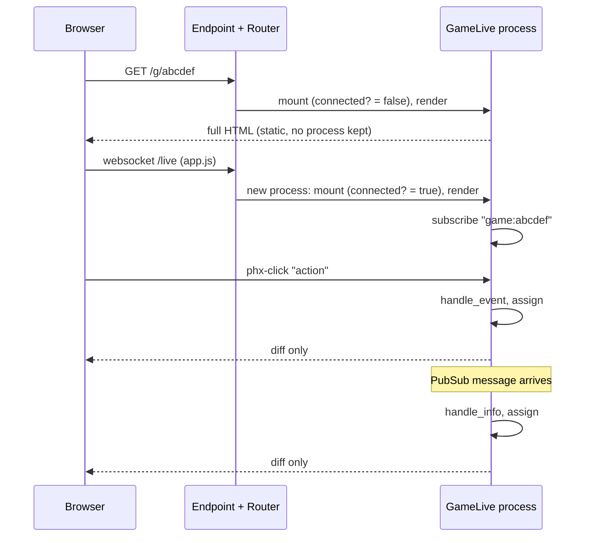

# 5. Routes and the LiveView lifecycle

[Back to the guide](../GUIDE.md)

## The router

The `:browser` pipeline (`lib/quacks_web/router.ex:4-12`) is a list of *plugs*. A
plug is a function `conn -> conn`, the Express middleware idea. Our only custom plug
is the last one, `QuacksWeb.Plugs.PlayerToken` (chapter 4).

```elixir
scope "/", QuacksWeb do
  pipe_through :browser

  live "/", LobbyLive
  live "/g/:id", GameLive
end
```

(`lib/quacks_web/router.ex:18-23`)

Two pages. The `scope` adds the `QuacksWeb.` prefix. `:id` becomes `params["id"]` in
`mount/3`.

**Not here: `live_session` and `handle_params`.** Apps with login group their
LiveViews in a `live_session` with `on_mount` hooks that load the user. This app has
no accounts, so it has no `live_session` and no `current_scope`; the token plug does
the identity job. `handle_params/3` runs after `mount` and on every `<.link patch>`
(a URL change inside one LiveView). Both pages read their params once in `mount` and
change page with `push_navigate`, so neither defines it. A URL that changes inside
the game page (`/g/:id?sheet=log`) would go there.

## The lifecycle of one tab



`mount/3` runs **twice**. The first run answers the HTTP request with plain HTML
(fast first paint). Then `app.js` opens the websocket and a new LiveView process
mounts again. That process lives as long as the tab. So `mount` subscribes only when
connected (`lib/quacks_web/live/game_live.ex:104`):

```elixir
if connected?(socket), do: Phoenix.PubSub.subscribe(Quacks.PubSub, GameServer.topic(id))
```

`GameLive.mount/3` (`lib/quacks_web/live/game_live.ex:101-134`) gets the table (not
found: flash and `push_navigate` to `/`), subscribes, claims a seat (`nil` for a
spectator; only the connected mount is watched, chapter 4), and assigns the id,
token, seat, `seen`, table and game.

`assign/2` is how a LiveView keeps state. `socket.assigns` is a map; the template
reads it as `@name`. When an assign changes, LiveView re-renders only the template
parts that read it, and sends only the diff.

## Events: from a click to the engine

```heex
<.button
  phx-click="action"
  phx-value-action={encode(:draw)}
  disabled={:draw not in @actions}
  variant={:primary}
  data-slot="draw"
>
  Draw a chip
</.button>
```

(`lib/quacks_web/live/game_live.ex:961-969`)

`phx-click="action"` sends the event `"action"`; `phx-value-action` adds
`%{"action" => "..."}` to the params. One handler serves every game move
(`lib/quacks_web/live/game_live.ex:136-155`):

```elixir
def handle_event("action", %{"action" => encoded}, %{assigns: %{seat: seat}} = socket)
    when is_integer(seat) do
  with {:ok, action} <- decode(encoded),
       {:ok, game} <- GameServer.apply(socket.assigns.id, seat, action) do
    {:noreply, put_game(socket, finish_shop(game, socket.assigns.id, seat, action))}
  else
    {:error, {:illegal_action, action, _phase}} ->
      {:noreply, put_flash(socket, :error, "#{label(action)} is not allowed right now.")}

    {:error, :bad_action} ->
      {:noreply, put_flash(socket, :error, "That move could not be read.")}

    {:error, :not_found} ->
      {:noreply, ended(socket)}
  end
end

def handle_event("action", _params, socket),
  do: {:noreply, put_flash(socket, :error, "You are watching this game.")}
```

- The head matches the event name, the params *and* the socket. The guard
  `when is_integer(seat)` sends spectators (`seat: nil`) to the second clause.
- A bad payload or an illegal move shows a flash; the process does not crash
  (`test/quacks_web/live/game_live_test.exs:81-95` checks it).
- `{:error, :not_found}`: the GameServer is gone (idled out, crashed, or the node
  restarted). See "When the game is gone" below.
- A new rule needs no new `handle_event`.

## Encoding actions into `phx-value-*`

Actions are terms like `{:buy, [{:green, 2}]}`; HTML attributes are strings. So
(`lib/quacks_web/live/game_live.ex:2554`):

```elixir
def encode(action), do: action |> :erlang.term_to_binary() |> Base.url_encode64(padding: false)
```

`decode/1` (`lib/quacks_web/live/game_live.ex:2561-2570`) reverses it with
`Plug.Crypto.non_executable_binary_to_term(binary, [:safe])`. The value comes from
the browser, so it is untrusted. `[:safe]` refuses to create new atoms (atoms are
never garbage-collected, so atoms from users are a memory leak), and
`non_executable_` refuses functions. A decoded but illegal action still meets
`legal_actions/2` in the engine. One encoder covers every action shape, and the
engine is the only validator.

## Broadcasts arrive as `handle_info`

PubSub messages arrive in the mailbox like any message
(`lib/quacks_web/live/game_live.ex:366-380`):

```elixir
# The game began: seats were renumbered, so ask for ours again.
def handle_info({:game, _id, game}, %{assigns: %{game: nil}} = socket),
  do: {:noreply, socket |> clear_flash(:info) |> reseat() |> put_game(game)}

# Our own moves arrive twice (reply and broadcast); skip the copy we already have.
# A broadcast sent before our own call's reply can come after it: every action
# adds to the log, so a shorter log is an older game, and we skip it too.
def handle_info({:game, _id, game}, socket) do
  current = socket.assigns.game

  if game == current or length(game.log) < length(current.log),
    do: {:noreply, socket},
    else: {:noreply, put_game(socket, game)}
end
```

`game == current` compares by value, deeply. No custom `equals`. The log length is
a cheap version number: the engine adds at least one entry per action.
`{:play_again, _id, new_id}` calls `push_navigate/2`, so every tab moves to the next
game (`lib/quacks_web/live/game_live.ex:404-406`).

## Derived assigns: `@me`, `@decision`, `@actions`

The template never calls the engine in a loop. `put_game/2` computes what the page
needs, once per new game (`lib/quacks_web/live/game_live.ex:2181-2201`):

```elixir
seat = socket.assigns.seat
me = if seat, do: game.players[seat]
actions = if seat && not Game.over?(game), do: Game.legal_actions(game, seat), else: []
{decision, skip_rubies} = decide(actions, seat && Game.phase(game, seat), me)
```

- `@me`: this seat's `%Player{}`, or `nil` for a spectator.
- `@all_actions`: every legal action of this seat.
- `@decision`: which decision dialog must be open, from the seat's phase
  (`lib/quacks_web/live/game_live.ex:2347-2359`); `nil` while brewing. `decide/3`
  turns an empty rubies step (nothing to spend, no witch to call) into `nil` plus
  `skip_rubies`, and the page ends the round for that seat.
- `@actions`: the actions for the bottom bar; empty while a decision is open, so the
  bar cannot bypass the dialog.

This is the React "selector" idea. Because `put_game/2` is the only place that sets
these assigns, the reply path and the broadcast path cannot disagree.

## Flash, navigation, two renders

- `put_flash(socket, :error, "...")` shows a toast; `<Layouts.app>` renders it
  (`lib/quacks_web/components/layouts.ex:49`).
- `push_navigate(socket, to: ~p"/g/#{id}")` starts a new LiveView. `~p` is a
  *verified route*: the compiler checks that the path exists in the router.
- Before the game begins, `@game` is `nil`. `render/1` has two clauses
  (`lib/quacks_web/live/game_live.ex:509` and `:681`): `def render(%{game: nil} =
  assigns)` draws the configure screen, the other the board. The begin broadcast
  sets `@game`, and the next render picks the other clause.
- `terminate/2` frees the seat when a tab closes before the start
  (`lib/quacks_web/live/game_live.ex:410-415`).

`LobbyLive` is the small version of the same pattern: subscribe to `"lobby"`, list
`GameServer.open_games/0`, list again on `:games_changed`
(`lib/quacks_web/live/lobby_live.ex:23-45`).

## Acknowledgement events: `"seen"`

A dialog that opens once per round (the new fortune card, the round results) must
not open again on a reload. The page tells the server when the seat closes one.
`dialog_sheet` takes an `on_close` JS command; app.js runs it on the dialog's
`close` event. For the card (`lib/quacks_web/live/game_live.ex:1287`):

```heex
on_close={JS.push("seen", value: %{kind: "card", round: @game.round})}
```

The handler checks the params and calls `GameServer.ack/4` (chapter 4), then keeps
the same map in the `@seen` assign (`lib/quacks_web/live/game_live.ex:286-299`):

```elixir
def handle_event(
      "seen",
      %{"kind" => kind, "round" => round},
      %{assigns: %{seat: seat}} = socket
    )
    when is_integer(seat) and kind in ["card", "results"] and is_integer(round) do
  kind = String.to_existing_atom(kind)
  GameServer.ack(socket.assigns.id, seat, kind, round)
  {:noreply, socket |> update(:seen, &Map.put(&1, kind, round)) |> skip_rubies()}
end

def handle_event("seen", _params, socket), do: {:noreply, socket}
```

- The guard accepts only the two known kinds, so `String.to_existing_atom/1` never
  makes an atom from user input. Anything else falls to the no-op clause.
- `mount/3` reads `seen` from the table. `seen?/3`
  (`lib/quacks_web/live/game_live.ex:2257-2262`) then drives `auto_open` on the
  dialogs: a closed card or closed results mount closed, and the results get
  `replay-done`, so the replay does not run again.
- A spectator's `seen` is `:all`: no card or results open on top of each other.
- Order: the results open the shop or the rubies step when they close
  (`then_open`). A droplet or patient choice at the start of a round waits for the
  new card the same way: the card's `then_open` names the decision dialog.

## When the game is gone: `:not_found`

A GameServer can stop under an open tab: it idles out after 2 hours, it crashes, or
the node restarts. Every `GameServer` call then returns `{:error, :not_found}`;
`call/2` also catches a server that dies during the call (chapter 4). Every
handler that calls the server has a `{:error, :not_found}` branch, and all of them
end the same way (`lib/quacks_web/live/game_live.ex:435-438`):

```elixir
# The game process is gone (it stopped or crashed): back to the lobby.
defp ended(socket) do
  socket |> put_flash(:error, "This game has ended.") |> push_navigate(to: ~p"/")
end
```

Before this, a click after a crash raised a `WithClauseError` (the `with` in the
`"action"` handler had no `else` branch for it), so the LiveView crashed and
remounted into the lobby with no word. Now the flash says why. `mount/3` has its
own branch: a game id that does not exist is "Game abcdef does not exist."
(`lib/quacks_web/live/game_live.ex:130-133`).
