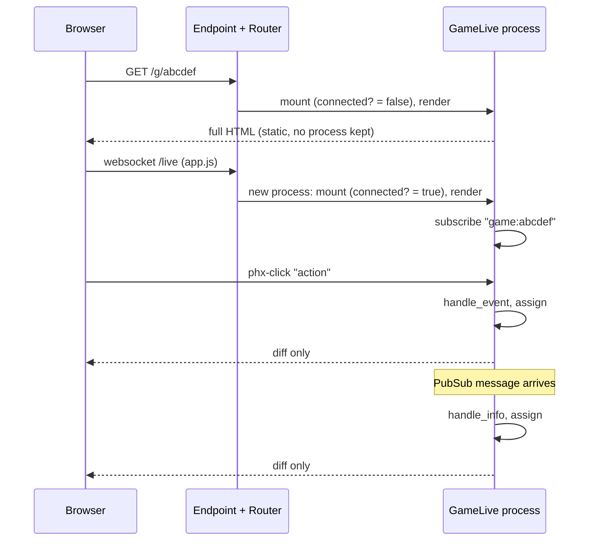

# 5. Routes and the LiveView lifecycle

[Back to the guide](../GUIDE.md)

## The router

The `:browser` pipeline (`lib/quacks_web/router.ex:4-12`) is a list of *plugs*. A
plug is a function `conn -> conn`, the Express middleware idea. Our only custom plug
is the last one, `QuacksWeb.Plugs.PlayerToken` (chapter 4).

```elixir
scope "/", QuacksWeb do
  pipe_through :browser

  live "/", LobbyLive
  live "/g/:id", GameLive
  # Gated in the controller: dev, or DEBUG_TOKEN.
  get "/debug/replay", DebugReplayController, :show
end
```

(`lib/quacks_web/router.ex:18-25`)

Two pages and one plain controller route (see "Debug replay" below). The `scope`
adds the `QuacksWeb.` prefix. `:id` becomes `params["id"]` in `mount/3`.

**Not here: `live_session` and `handle_params`.** Apps with login group their
LiveViews in a `live_session` with `on_mount` hooks that load the user. This app has
no accounts, so it has no `live_session` and no `current_scope`; the token plug does
the identity job. `handle_params/3` runs after `mount` and on every `<.link patch>`
(a URL change inside one LiveView). Both pages read their params once in `mount` and
change page with `push_navigate`, so neither defines it. A URL that changes inside
the game page (`/g/:id?sheet=log`) would go there.

## The lifecycle of one tab



`mount/3` runs **twice**. The first run answers the HTTP request with plain HTML
(fast first paint). Then `app.js` opens the websocket and a new LiveView process
mounts again. That process lives as long as the tab. So `mount` subscribes only when
connected (`lib/quacks_web/live/game_live.ex:119`):

```elixir
if connected?(socket), do: Phoenix.PubSub.subscribe(Quacks.PubSub, GameServer.topic(id))
```

`GameLive.mount/3` (`lib/quacks_web/live/game_live.ex:116-150`) gets the table (not
found: flash and `push_navigate` to `/`), subscribes, claims a seat (`nil` for a
spectator; only the connected mount is watched, chapter 4), and assigns the id,
token, seat, `seen`, table and game.

`assign/2` is how a LiveView keeps state. `socket.assigns` is a map; the template
reads it as `@name`. When an assign changes, LiveView re-renders only the template
parts that read it, and sends only the diff.

## Events: from a click to the engine

```heex
<.button
  phx-click="action"
  phx-value-action={encode(:draw)}
  disabled={:draw not in @actions}
  variant={:primary}
  data-slot="draw"
>
  Draw a chip
</.button>
```

(`lib/quacks_web/live/game_live.ex:1234-1242`)

`phx-click="action"` sends the event `"action"`; `phx-value-action` adds
`%{"action" => "..."}` to the params. One handler serves every game move
(`lib/quacks_web/live/game_live.ex:152-171`):

```elixir
def handle_event("action", %{"action" => encoded}, %{assigns: %{seat: seat}} = socket)
    when is_integer(seat) do
  with {:ok, action} <- decode(encoded),
       {:ok, game} <- GameServer.apply(socket.assigns.id, seat, action) do
    {:noreply, put_game(socket, finish_shop(game, socket.assigns.id, seat, action))}
  else
    {:error, {:illegal_action, action, _phase}} ->
      {:noreply, put_flash(socket, :error, "#{label(action)} is not allowed right now.")}

    {:error, :bad_action} ->
      {:noreply, put_flash(socket, :error, "That move could not be read.")}

    {:error, :not_found} ->
      {:noreply, ended(socket)}
  end
end

def handle_event("action", _params, socket),
  do: {:noreply, put_flash(socket, :error, "You are watching this game.")}
```

- The head matches the event name, the params *and* the socket. The guard
  `when is_integer(seat)` sends spectators (`seat: nil`) to the second clause.
- A bad payload or an illegal move shows a flash; the process does not crash
  (`test/quacks_web/live/game_live_test.exs:81-95` checks it).
- `{:error, :not_found}`: the GameServer is gone (idled out, crashed, or the node
  restarted). See "When the game is gone" below.
- A new rule needs no new `handle_event`.
- One move has its own event: `"keep_white"`
  (`lib/quacks_web/live/game_live.ex:173-182`). It is not a legal action of the
  engine but an undo of the server's Mandrake answer, so it calls
  `GameServer.keep_white/2` (chapter 4).

## Encoding actions into `phx-value-*`

Actions are terms like `{:buy, [{:green, 2}]}`; HTML attributes are strings. So
(`lib/quacks_web/live/game_live.ex:2964`):

```elixir
def encode(action), do: action |> :erlang.term_to_binary() |> Base.url_encode64(padding: false)
```

`decode/1` (`lib/quacks_web/live/game_live.ex:2971-2980`) reverses it with
`Plug.Crypto.non_executable_binary_to_term(binary, [:safe])`. The value comes from
the browser, so it is untrusted. `[:safe]` refuses to create new atoms (atoms are
never garbage-collected, so atoms from users are a memory leak), and
`non_executable_` refuses functions. A decoded but illegal action still meets
`legal_actions/2` in the engine. One encoder covers every action shape, and the
engine is the only validator.

## Broadcasts arrive as `handle_info`

PubSub messages arrive in the mailbox like any message
(`lib/quacks_web/live/game_live.ex:440-455`):

```elixir
# The game began: seats were renumbered, so ask for ours again.
def handle_info({:game, _id, game}, %{assigns: %{game: nil}} = socket),
  do: {:noreply, socket |> clear_flash(:info) |> reseat() |> put_game(game)}

# Our own moves arrive twice (reply and broadcast); skip the copy we already have.
# A broadcast sent before our own call's reply can come after it: every action
# adds to the log, so a shorter log is an older game, and we skip it too.
def handle_info({:game, _id, game}, socket) do
  current = socket.assigns.game

  if game == current or length(game.log) < length(current.log),
    do: {:noreply, socket},
    else: {:noreply, put_game(socket, game)}
end
```

`game == current` compares by value, deeply. No custom `equals`. The log length is
a cheap version number: the engine adds at least one entry per action.
`{:play_again, _id, new_id}` calls `push_navigate/2`, so every tab moves to the next
game (`lib/quacks_web/live/game_live.ex:478-480`).

## Derived assigns: `@me`, `@decision`, `@actions`

The template never calls the engine in a loop. `put_game/2` computes what the page
needs, once per new game (`lib/quacks_web/live/game_live.ex:2513-2533`):

```elixir
seat = socket.assigns.seat
me = if seat, do: game.players[seat]
actions = if seat && not Game.over?(game), do: Game.legal_actions(game, seat), else: []
{decision, skip_rubies} = decide(actions, seat && Game.phase(game, seat), me)
```

- `@me`: this seat's `%Player{}`, or `nil` for a spectator.
- `@all_actions`: every legal action of this seat.
- `@decision`: which decision dialog must be open, from the seat's phase
  (`lib/quacks_web/live/game_live.ex:2756-2768`); `nil` while brewing. `decide/3`
  turns an empty rubies step (nothing to spend, no witch to call) into `nil` plus
  `skip_rubies`. The page then shows one "Done" button that sends `:end_round`
  (`lib/quacks_web/live/game_live.ex:1112-1123`). An automatic end ended solo
  rounds while the update chips still played, so the player now taps once.
- `@actions`: the actions for the bottom bar; empty while a decision is open, so the
  bar cannot bypass the dialog.

This is the React "selector" idea. Because `put_game/2` is the only place that sets
these assigns, the reply path and the broadcast path cannot disagree.

## Flash, navigation, two renders

- `put_flash(socket, :error, "...")` shows a toast; `<Layouts.app>` renders it
  (`lib/quacks_web/components/layouts.ex:49`).
- `push_navigate(socket, to: ~p"/g/#{id}")` starts a new LiveView. `~p` is a
  *verified route*: the compiler checks that the path exists in the router.
- Before the game begins, `@game` is `nil`. `render/1` has two clauses
  (`lib/quacks_web/live/game_live.ex:686` and `:862`): `def render(%{game: nil} =
  assigns)` draws the configure screen, the other the board. The begin broadcast
  sets `@game`, and the next render picks the other clause.
- `terminate/2` frees the seat when a tab closes before the start
  (`lib/quacks_web/live/game_live.ex:484-488`).

`LobbyLive` (the **spell book**, round 17) is the small version of the same
pattern: subscribe to `"lobby"`, list `GameServer.games/1` (public games and your
own, waiting or playing), list again on `:games_changed`. The server broadcasts it
when seats or games change and when a game's round changes (`stage/1` in
`changed/2`), so the Join page's "Round 3 of 9" stays fresh.

Unlike the configure screen, the book holds its settings in the page's own assigns:
no game exists until the Start seal. Each event (`"players"`, `"sets"`, `"rules"`,
`"public"`, `"add_bot"`, `"random_books"`, ...) changes an assign and pushes
`"save_config"` to the `ConfigMemory` hook (localStorage, the same key the
configure screen uses); on mount the hook sends `"load_config"` back. `"start"`
builds one config map and calls `GameServer.create/3`, which seats you, your name
and colour and the bots in one call, so a solo or all-bot game begins at once
without a waiting room.

Which page shows is not an assign. A bookmark runs a JS command,
`JS.set_attribute({"data-page", page}, to: "#spell-book")`, and CSS shows the
matching `[data-book-page]`. LiveView keeps attributes set by JS commands across
patches, so a change from the server never turns the page back, and the turn needs
no round trip. `?page=join` sets the first `data-page` from the server.

## Acknowledgement events: `"seen"`

Three things play once: the new fortune card, the round results and (round 14)
the final scoring. They must not play again on a reload. Since round 14 all three
show in the reveal overlay (chapter 6), and the server ends it, so most acks start
on the server: `close_reveal/1` calls `mark_seen/2`, which calls `GameServer.ack/4`
(chapter 4) and keeps the same map in the `@seen` assign.

The browser still sends `"seen"` in one place: the card dialog that holds a
fortune choice runs `on_close` on its `close` event:

```heex
on_close={JS.push("seen", value: %{kind: "card", round: @game.round})}
```

The handler accepts only the three known kinds, so `String.to_existing_atom/1`
never makes an atom from user input. When the kind and round match the open
overlay, it ends the overlay; otherwise it only acks:

```elixir
def handle_event("seen", %{"kind" => kind, "round" => round}, %{assigns: %{seat: seat}} = socket)
    when is_integer(seat) and kind in ["card", "results", "final"] and is_integer(round) do
  key = {String.to_existing_atom(kind), round}

  socket =
    case socket.assigns.reveal do
      %{key: ^key} -> close_reveal(socket)
      _other -> socket |> mark_seen(key) |> auto_done()
    end

  {:noreply, socket}
end
```

- `mount/3` reads `seen` from the table, and `open_reveal/1` opens the overlay only
  for a moment that is not seen. `replaying?/2` drives the players row: a seen
  round mounts with `replay-done`, so the counters show at once.
- A spectator's `seen` is `:all`: no overlay, no replay.
- Order: a decision dialog mounts with `auto_open={is_nil(@reveal)}`. When the
  overlay ends, the server pushes `quacks:open` with the waiting dialog (the shop,
  the rubies step, a droplet or patient choice, the game-over sheet), and app.js
  opens it.

## When the game is gone: `:not_found`

A GameServer can stop under an open tab: it idles out after 2 hours, it crashes, or
the node restarts. Every `GameServer` call then returns `{:error, :not_found}`;
`call/2` also catches a server that dies during the call (chapter 4). Every
handler that calls the server has a `{:error, :not_found}` branch, and all of them
end the same way (`lib/quacks_web/live/game_live.ex:611-614`):

```elixir
# The game process is gone (it stopped or crashed): back to the lobby.
defp ended(socket) do
  socket |> put_flash(:error, "This game has ended.") |> push_navigate(to: ~p"/")
end
```

Before this, a click after a crash raised a `WithClauseError` (the `with` in the
`"action"` handler had no `else` branch for it), so the LiveView crashed and
remounted into the lobby with no word. Now the flash says why. `mount/3` has its
own branch: a game id that does not exist is "Game abcdef does not exist."
(`lib/quacks_web/live/game_live.ex:145-148`).

## A form: "Report a problem"

The bug button in the header opens `bug_report_sheet/1`
(`lib/quacks_web/components/bug_report_components.ex:34-81`), a `dialog_sheet` with
a real form:

```heex
<.form for={@form} id={"bug-report-form-#{@n}"} phx-submit="report" data-bug-report>
  <.input field={@form[:text]} type="textarea" maxlength="2000" required />
  <input type="hidden" name={@form[:browser].name} value="" data-role="browser-details" />
```

- The form is `to_form(%{"text" => ""}, as: :report)` (`new_report/1`,
  `lib/quacks_web/live/game_live.ex:544-550`). There is no Ecto schema: `to_form/2`
  takes a plain map, and `as: :report` nests the params as `%{"report" => ...}`.
- The hidden field is filled in the browser. A capture-phase `submit` listener in
  app.js (`assets/js/app.js:28-39`) writes the user agent, the viewport, the online
  state and the last 10 console errors as JSON into it, just before LiveView
  reads the form. The server keeps only the known keys (`browser_details/1`,
  `lib/quacks_web/live/game_live.ex:552-568`).
- `handle_event("report", ...)` (lines 298-325) calls `Quacks.BugReports.submit/1`
  (chapter 4). On an error it assigns the form again with the player's text and one
  sentence; on success it counts up `@reports`. The dialog id holds that count
  (`"bug-report-#{@n}"`), so the next report gets a new, empty dialog: a new id is
  a new element, the same trick as React's `key`.
- The success toast holds a link to the issue. A flash is escaped text, so
  `reported/2` (lines 569-585) escapes the URL itself with
  `Phoenix.HTML.html_escape/1` and passes `{:safe, iodata}`.

## Debug replay: a controller, a mix task and a scrubber

To fix a reported bug, a developer loads the reported game in the browser.

**The route.** `GET /debug/replay` is a plain controller, not a LiveView: it does
its work and redirects (`lib/quacks_web/controllers/debug_replay_controller.ex:18-32`):

```elixir
def show(conn, params) do
  with :ok <- allowed(params),
       {:ok, bundle} <- bundle(params),
       {:ok, id} <-
         GameServer.start_from_bundle(bundle,
           at: int(params["at"]),
           seat: int(params["seat"]) || bundle["seat"],
           token: get_session(conn, "player_token")
         ) do
    redirect(conn, to: ~p"/g/#{id}")
  else
    {:error, :forbidden} -> send_resp(conn, 404, "Not Found")
    {:error, reason} -> send_resp(conn, 422, "Could not load the replay: #{inspect(reason)}")
  end
end
```

- The bundle comes from `issue=123` (`BugReports.fetch_bundle/1`) or from
  `bundle=<base64 JSON>` (lines 50-66). `at=N` stops after N actions, `seat=S`
  picks the seat (default: the reporter's).
- The browser's player token gets the seat, so after the redirect `GameLive.mount/3`
  claims it like any other seat.
- **Gating** (`allowed/1`, lines 34-48): the route is open when `:dev_routes` is
  set (dev only). Elsewhere it needs `token=` equal to the `DEBUG_TOKEN` env var,
  compared with `Plug.Crypto.secure_compare/2` (a constant-time compare, so the
  response time does not leak the token). Anything else is a 404, not a 403: the
  route does not say that it exists. The route sits in the normal `:browser` scope,
  not in the `dev_routes` block of the router, because prod needs it too (with the
  token); the gate is in the controller.

**The mix task.** `mix quacks.replay 123 [--at 212] [--seat 0] [--serve]`
(`lib/mix/tasks/quacks.replay.ex`) fetches the issue with a token from
`BUG_REPORT_GITHUB_TOKEN` or `gh auth token`, writes `tmp/replay-123.json` and
prints the URL. Without `--serve` the URL carries the bundle as base64, so the
running server needs no GitHub token. With `--serve` it starts the endpoint itself
(`Mix.Task.run("run", ["--no-halt"])`) and the URL has `issue=123`.

**The scrubber.** A debug table has `@debug` (from the table, chapter 4), and the
menu shows `scrubber/1` (`lib/quacks_web/live/game_live.ex:498-542`): "Action 212
of 340", one step back, one step forward and "Unfreeze bots". The events are
small (lines 285-296):

```elixir
def handle_event("seek", %{"to" => to}, %{assigns: %{debug: %{}}} = socket) do
  case GameServer.seek(socket.assigns.id, String.to_integer(to)) do
    {:ok, game} -> {:noreply, socket |> put_game(game) |> refresh_debug()}
    {:error, _} -> {:noreply, socket}
  end
end
```

The match `%{debug: %{}}` accepts any map and rejects `nil`. A normal table has
no clause for the event, so a forged `"seek"` crashes that one LiveView, which
remounts. That is acceptable for an event the page never sends there; the server
also refuses with `{:error, :not_debug}`. Each step replays the whole bundle up to that
action, which is fast because the engine is pure (chapter 3).
