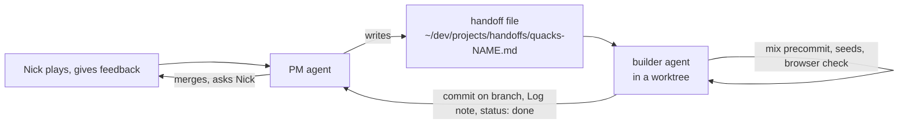

# 9. The agentic workflow and a cheat sheet

[Back to the guide](../GUIDE.md)

Most of this code was written by agents, with Nick as product owner and a PM agent
in between. The codebase shape and the workflow support each other.

## The loop

- **Handoffs.** One Markdown file per task in `~/dev/projects/handoffs/` (49 for this
  project so far). Front matter `from`, `to`, `status: open | done`, then the task,
  numbered steps, the verification and the commit rules. The builder sets
  `status: done` when it is finished.
- **Worktrees.** Engine and web work often run in parallel. Each builder works in
  its own git worktree under `.claude/worktrees/<name>` on its own branch, so two
  agents never edit the same checkout. The PM merges.
- **The project note Log.** `~/dev/projects/quacks-elixir.md` has one dated entry per
  finished handoff: commits, test counts, API changes, "judgement calls" and open
  questions. It is the decision record. Chapter 3 to 7 quote decisions from it.
- **recmem.** `.recmem/` in the repo holds task memory for agents (GNU recutils
  files), and `.recmem/pending/` holds commit scripts when GPG signing fails.
- **Taskwarrior.** Work that needs Nick (a browser check, a rules question) becomes
  a `task add ... +claude` entry.

## Why the codebase suits agents

- **The pure engine** is easy to test without a browser, so an agent can prove a
  rules change with `mix test` alone.
- **`legal_actions/2` as the single source of truth** means the UI, the bots and the
  property tests pick up a new action without extra work. An agent cannot forget to
  "also update the client".
- **Rules as data** (chapter 7) keeps corrections small and reviewable.
- **Moduledocs explain why**, and flag house readings with ⚠️. The next agent reads
  the reason next to the code.
- **`docs/CONTEXT.md`** is the shared glossary. Handoffs tell builders to read it.
- **`usage_rules`** copies the package authors' rules into `AGENTS.md`
  (`mix.exs:98-108`), so agents follow current Phoenix 1.8 / LiveView 1.2 practice.
- **Tidewave** (`lib/quacks_web/endpoint.ex:32-34`) lets an agent run code inside the
  running dev server (`project_eval`), read logs and docs for the exact dependency
  versions.

## Verification, the standard set

A builder is done when:

1. `mix precommit` is green (chapter 8), also with `--seed 0`, `--seed 1` and a
   random seed.
2. After a rules change: a few hundred simulated games reach game over
   (`mix quacks.sim`).
3. After a UI change: a real browser check. Builders start their own server on a
   free port from the worktree and drive a separate Chrome (`--remote-debugging-port=9223`),
   at phone size 390×844, never Nick's own browser.
4. The Log entry lists what was not checked (for example "Not checked on a real
   phone / Safari").

## Where to look when...

### ...you add an ingredient book

1. Text and tiers: `@books` and `@tiers` in `lib/quacks/rules/books.ex:44` and `:156`.
2. Prices, if the set changes them: `@prices` in `lib/quacks/rules/chips.ex:32`.
3. Allowed sets: `sets!/2` in `lib/quacks/game.ex:411-425`.
4. Behaviour, by when the book acts:
   - on draw: a `defp on_draw(g, seat, chip, {colour, set})` clause
     (`lib/quacks/game/potions.ex:385-517`), or a `bonus/3` clause for extra movement
     (`lib/quacks/game/potions.ex:563-611`);
   - in step B: a `defp chip_action(g, seat, {colour, set})` clause
     (`lib/quacks/game/evaluation.ex:145-300`); a choice adds to `chip_choices` and
     needs `options/3` and `choose/3` clauses (`lib/quacks/game/evaluation.ex:316-414`).
5. Log it with `Game.effect/4` and add a label: `defp effect(book, detail)` in
   `lib/quacks_web/components/game_components.ex:2227-2297`.
6. Tests: `force_draws/3` in `test/quacks/chip_effects_test.exs` or
   `test/quacks/ingredient_sets_test.exs`. Update `docs/CONTEXT.md`.

### ...you add a fortune card

1. Name and text: `@cards` in `lib/quacks/rules/fortune.ex:37`, and the id in
   `@type id` above it. Solo rules: `@not_solo` (`lib/quacks/rules/fortune.ex:83`) or
   `@solo_skip` (`lib/quacks/game/fortune.ex:25`).
2. Purple (once, at round start): an `auto/2` clause for the automatic part
   (`lib/quacks/game/fortune.ex:232-287`) and `choices`/`choose` clauses for a choice.
3. Blue (all round): a hook clause that other modules call, like
   `die_rolls/1` (`lib/quacks/game/fortune.ex:161-228`). If no hook fits, add one and
   call it from `Potions` or `Evaluation`.
4. Labels: `fortune_choice/2` in `lib/quacks_web/components/game_components.ex:2324-2346`.
5. Tests: `test/quacks/fortune_test.exs` (set `fortune_card:` with `put/3`).

### ...you add a UI dialog for a new decision

1. The engine gives the seat a new player phase, so `Game.phase/2` returns it.
2. `decision/3` in `lib/quacks_web/live/game_live.ex:1789-1801` already maps any
   unknown phase to itself, so `@decision` becomes your phase.
3. The decision dialog renders with id `"decision-#{@decision}"`
   (`lib/quacks_web/live/game_live.ex:950-955`). Add your content inside it, guarded by
   `:if={@decision == :your_phase}`.
4. Its title comes from `phase_name/1`
   (`lib/quacks_web/components/game_components.ex:2406-2429`).
5. If the choices are chips, teach `pick_chips/1` the action shape
   (`lib/quacks_web/live/game_live.ex:1539-1547`); `chip_picks/1` does the rest.
6. Test with `has_element?(view, "#decision-your_phase")` and `render_click`.

### ...you add a house rule

1. Engine: the allowed values in `@rule_values` and the default in `@rules`
   (`lib/quacks/game.ex:80-103`), the `@type rules` (`lib/quacks/game.ex:301-312`), then
   read `g.rules.your_rule` where it matters.
2. Spell book: `options_form/1` and the copy of `@rule_values` in
   `lib/quacks_web/components/setup_components.ex:43` and `:218`; `parse_rules/1`
   turns the form into the map.
3. In-game summary: `rule_label/1` near `lib/quacks_web/components/game_components.ex:1540`.
4. Tests: add the rule to the `rules()` generator (`test/quacks/game_test.exs:736-749`)
   so the property test plays it, and a focused test in
   `test/quacks/house_rules_test.exs`.

### ...something looks wrong in a real game

1. Note the seed (shown in the menu) and what you did.
2. Rebuild it in IEx: `Quacks.Session.replay(seed, players, actions, opts)`.
3. Or read the live game with Tidewave:
   `{:ok, t} = Quacks.GameServer.get("abcdef"); t.game.log`.
